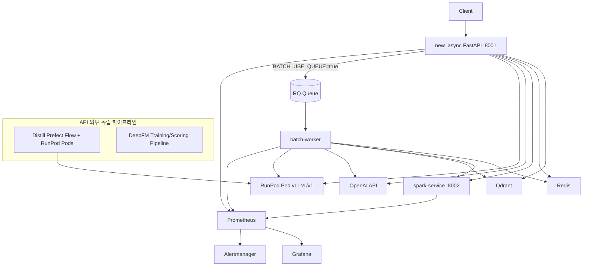

# Tasteam New Async

레스토랑 리뷰를 대상으로 **벡터 적재/검색**, **감성 분석**, **LLM 요약**, **비교 분석**을 제공하는 FastAPI 서비스입니다.  
핵심 목표는 API 응답 안정성을 유지하면서도, Spark/LLM/배치 워커를 분리해 대규모 처리 성능을 확보하는 것입니다.

## TL;DR

- FastAPI 기반 리뷰 분석 플랫폼으로 `Vector/Sentiment/Summary/Comparison` API를 제공합니다.
- 운영은 `app`, `batch`, `obs`, `ml`을 Docker Compose로 분리/통합 모두 지원합니다.
- 빠른 시작은 `make up-dev` -> `http://localhost:8001/ai/docs` 확인 순서가 가장 간단합니다.

> **30초 요약**
> - 문제: 리뷰 데이터 분석/요약 파이프라인을 운영 가능한 형태로 제공
> - 해결: API + Batch + Observability + ML 파이프라인을 도커 기반으로 분리 운영
> - 근거: Val/Test ROUGE, BERTScore, LLM Judge, 스키마 안정성 지표를 정량 제시

처음 방문했다면 `TL;DR -> 5분 실행 -> 성과/정량 지표 -> Advanced` 순서로 읽는 것을 권장합니다.

## 성과 / 정량 지표 (Distill Eval)

기준 실험: `distill_pipeline_output/eval/final_eval/g4nca6b2/20260323_193547`

- **Val (n=944)**: ROUGE-1 `0.8094`, ROUGE-2 `0.6665`, ROUGE-L `0.8083`, BERTScore-F1 `0.8381`
- **Test (n=1273)**: ROUGE-1 `0.8267`, ROUGE-2 `0.6958`, ROUGE-L `0.8243`, BERTScore-F1 `0.8395`
- **LLM-as-a-Judge (n=50, gpt-4o)**: 평균 점수 `3.85/5.0`
- **구조 안정성(KD/SFT 분석, n=50)**: JSON 파싱 성공률 `100%`, 스키마 정확도 `100%`
- **출력 길이 안정성**: 예측/참조 길이 비율 `1.0229` (과도한 길이 드리프트 없음)

## 5분 실행 (Quick Start)

```bash
# 1) dev 통합 기동
make up-dev

# 2) 상태/로그 확인
make ps-dev
make logs-dev
```

확인 URL:

- Swagger: `http://localhost:8001/ai/docs`
- Health: `http://localhost:8001/health`
- Readiness: `http://localhost:8001/ready`

중지:

```bash
make down-dev
```

## 한눈에 보기

- **API 진입점**: `app.py` -> `src.api.main:app` (기본 포트 `8001`)
- **핵심 저장소**: Qdrant(리뷰 벡터), Redis(락/캐시/RQ 큐)
- **외부 연산 계층**: Spark 서비스(`spark-service`), LLM(OpenAI 또는 RunPod vLLM Pod)
- **비동기 처리**: `asyncio.Queue` + 워커 + 리소스별 세마포어
- **관측성**: `/metrics` 기반 Prometheus + Grafana + Alertmanager

## 아키텍처 다이어그램



## 주요 파이프라인

### 1) Vector (`/ai/api/v1/vector`)

- `POST /ai/api/v1/vector/upload`
- 리뷰를 Dense+Sparse 임베딩으로 변환해 Qdrant에 업로드합니다.
- 현재 유사 검색 엔드포인트는 외부 공개하지 않고, Summary/Sentiment/Comparison 내부에서 조회에 사용합니다.

### 2) Sentiment (`/ai/api/v1/sentiment`)

- `POST /analyze`, `POST /analyze/batch`
- 1차 HuggingFace 분류 후 일부 부정 샘플을 LLM으로 재판정해 비율을 보정합니다.
- 결과: `positive/negative/neutral` count 및 ratio

### 3) Summary (`/ai/api/v1/llm`)

- `POST /summarize`, `POST /summarize/batch`
- 카테고리(`service`, `price`, `food`)별 검색 후 LLM 요약을 생성합니다.
- 출력은 `overall_summary` + 카테고리별 `summary/bullets/evidence` 구조입니다.

### 4) Comparison (`/ai/api/v1/llm`)

- `POST /comparison`, `POST /comparison/batch`
- 단일 매장 비율(service/price)을 전체 평균과 비교해 lift(%)를 계산합니다.
- 현재 비교 설명은 템플릿 기반(LLM 미사용)으로 생성됩니다.

### 5) Batch (`/ai/api/v1/batch`)

- `POST /enqueue`, `GET /status/{job_id}`
- `BATCH_USE_QUEUE=true`면 API는 큐에 적재만 수행하고, `batch-worker`가 실제 작업을 처리합니다.

## 배포/운영 포인트

- **MSA 분리**: API, Spark, Batch Worker, LLM 서빙(vLLM Pod) 분리
- **중복 실행 방지**: Redis 분산 락 (`restaurant_id + analysis_type`)
- **재실행 생략(SKIP)**: 최근 성공 이력이 있으면 파이프라인 생략 가능
- **관측성**: `app_queue_depth`, `event_loop_lag_seconds`, `analysis_processing_time_seconds` 등 메트릭 제공

## Advanced: Docker 운영/배포

현재 레포는 Docker 기준으로 `app`(API)와 `retrieval-service`를 분리해 실행할 수 있습니다.  
(`docker-compose.yml` 기준: `app:8001`, `retrieval-service:8010`)

<details>
<summary>고급 운영 설정 펼치기</summary>

### Compose 파일 전략

- 로컬 통합(dev only): `docker-compose.yml`, `compose.ml.yml`
- 운영 분리: `compose.app.yml`, `compose.batch.yml`, `compose.obs.yml`, `compose.deepfm.yml`, `compose.distill.yml`
- 공통 리소스: `compose.base.yml` (공통 네트워크/볼륨)
- 실행 편의 통합: `compose.stack.yml` (`--profile app|batch|obs|ml`)

### 1) Docker Compose로 실행 (권장)

```bash
# .env 준비 후
docker compose up -d --build

# 상태 확인
docker compose ps

# 로그 확인
docker compose logs -f app
docker compose logs -f retrieval-service
```

확인 URL:

- API Swagger: `http://localhost:8001/ai/docs`
- Retrieval service: `http://localhost:8010`
- API Health: `http://localhost:8001/health`

### 로컬 Python 실행 (선택)

```bash
python -m venv venv
source venv/bin/activate
pip install -r requirements.txt

export LLM_PROVIDER="openai"        # openai | runpod | local
export OPENAI_API_KEY="..."
export OPENAI_MODEL="gpt-4o-mini"
export QDRANT_URL="./qdrant_data"
export REDIS_HOST="localhost"
export REDIS_PORT="6379"

python app.py
# 또는
uvicorn src.api.main:app --host 0.0.0.0 --port 8001 --reload
```

문서/헬스체크:

- Swagger: `http://localhost:8001/ai/docs`
- ReDoc: `http://localhost:8001/ai/redoc`
- Health: `GET /health`
- Readiness: `GET /ready`
- Metrics: `GET /metrics`

### 2) 운영 분리/프로필 실행 (핵심 명령)

```bash
# 분리 compose
docker compose -f compose.base.yml -f compose.app.yml up -d --build

# 단일 스택(profile)
docker compose -f compose.base.yml -f compose.stack.yml --profile app up -d --build
```

Makefile 커맨드 사용(권장):

```bash
# 도움말
make help

# dev 통합
make up-dev
make logs-dev
make down-dev

# profile 기반 실행 (예: app)
make up-app

# 전체 실행/중지
make up-all
make down-all
```

Distill 2단계 실행(runbook): `docs/ops/distill_two_step.md`

### 3) 단일 이미지 빌드 예시

```bash
# API
docker build -f dockerfile -t tasteam-app:latest .

# Retrieval service
docker build -f Dockerfile.retrieval-service -t tasteam-retrieval-service:latest .

# Distill orchestrator
docker build -f Dockerfile.distill-orchestrator -t tasteam-distill-orchestrator:latest .
```

### 4) 운영 환경(AWS 등) 권장 방식

- API(`app`)와 Retrieval(`retrieval-service`)를 **별도 서비스/태스크**로 분리 배포
- 모델 캐시(`HF_HOME`, `EMBEDDING_CACHE_DIR`) 및 Qdrant 데이터 경로는 볼륨/영속 스토리지로 관리
- 환경 변수는 `.env` 파일 또는 시크릿 매니저로 주입
- 배포 후 `GET /health`, `GET /ready`, `GET /metrics`를 헬스체크/모니터링에 연결

### 5) 환경 변수 (최소 필수 / 선택)

최소 실행 필수값:

| 구분 | 필수 환경 변수 |
|---|---|
| dev 통합 (`make up-dev`) | `OPENAI_API_KEY` (또는 `LLM_PROVIDER=runpod` + `VLLM_POD_BASE_URL`) |
| app/retrieval 안정 운영 | `QDRANT_URL`, `OPENAI_MODEL`, `LLM_PROVIDER` |
| batch 운영 | `BATCH_USE_QUEUE=true`, `REDIS_HOST`, `REDIS_PORT`, `SPARK_SERVICE_URL` |
| distill 실행 | `RUNPOD_API_KEY`, `RUNPOD_S3_ACCESS_KEY`, `RUNPOD_S3_SECRET_ACCESS_KEY`, `WANDB_API_KEY`, `WANDB_PROJECT` |

운영/실험 선택값:

| 구분 | 선택 환경 변수 |
|---|---|
| 공통 | `WANDB_ENTITY`, `REDIS_DB`, `REDIS_PASSWORD` |
| LLM | `VLLM_POD_BASE_URL`, `OPENAI_MODEL` |
| 기타 | 모델 캐시/경로 관련 변수(`HF_HOME`, `EMBEDDING_CACHE_DIR` 등) |

> 참고: Distill 관련 플로우(`sweep_pod_best_adapter`, `evaluate_on_pod`)는 RunPod/W&B 인증 키가 없으면 실패합니다.

### 6) 실행 전 검증 체크리스트

```bash
# compose 병합 결과 검증
docker compose -f compose.base.yml -f compose.app.yml config
docker compose -f compose.base.yml -f compose.batch.yml config
docker compose -f compose.base.yml -f compose.obs.yml config
docker compose -f compose.base.yml -f compose.stack.yml config

# 상태 확인
docker compose -f compose.base.yml -f compose.stack.yml ps
```

기동 후 확인:

- API: `GET /health`, `GET /ready`, `GET /metrics`
- Prometheus: `http://localhost:9090`
- Grafana: `http://localhost:3000`

### 7) 트러블슈팅 (5줄 요약)

- `docker: command not found` -> Docker Desktop/Engine 설치 및 실행 확인
- `RUNPOD_API_KEY`/`WANDB_API_KEY` 오류 -> `.env` 키 존재/유효성 확인
- `adapter path is not a directory` -> `DISTILL_ADAPTER_PATH` 실제 경로 확인
- Batch 미처리 -> `make up-batch` 후 `redis/spark-service/batch-worker` 상태 확인
- Metrics 비노출 -> `/metrics` 및 Prometheus target 상태 확인

상세 트러블슈팅: `docs/ops/troubleshooting.md`

</details>

## 주요 엔드포인트 요약

| 기능 | 메서드 | 엔드포인트 |
|---|---|---|
| 벡터 업로드 | POST | `/ai/api/v1/vector/upload` |
| 감성 분석 | POST | `/ai/api/v1/sentiment/analyze` |
| 감성 분석(배치) | POST | `/ai/api/v1/sentiment/analyze/batch` |
| 요약 | POST | `/ai/api/v1/llm/summarize` |
| 요약(배치) | POST | `/ai/api/v1/llm/summarize/batch` |
| 비교 | POST | `/ai/api/v1/llm/comparison` |
| 비교(배치) | POST | `/ai/api/v1/llm/comparison/batch` |
| 배치 enqueue | POST | `/ai/api/v1/batch/enqueue` |
| 배치 상태 | GET | `/ai/api/v1/batch/status/{job_id}` |

## 프로젝트 구조

```text
.
├── src/                    # FastAPI 앱, 라우터, 파이프라인 로직
├── scripts/                # 배치/운영/학습 보조 스크립트
├── ml/deepfm_pipeline/     # DeepFM 학습/배치 추론 파이프라인 (API 외부)
├── docs/                   # 아키텍처/운영 문서
├── app.py                  # 서버 실행 진입점
└── requirements.txt
```

## 상세 문서

- 아키텍처 원문: `docs/architecture/ARCHITECTURE_OVERVIEW.md`
- 문서 인덱스: `docs/README.md`
- Spark 서비스: `docs/spark/SPARK_SERVICE.md`
- 오프라인 배치: `docs/batch/offline_batch_processing.md`
- RunPod 운영: `docs/runpod/why_dont_use_runpod_serverless.md`

## 현재 한계 / 로드맵

- **한계**: Docker 실행 검증(`docker compose ... config/up`)은 사용자 환경 Docker 설치 상태에 의존합니다.
- **한계**: Distill 단계는 RunPod/W&B/OpenAI 키 준비가 선행되지 않으면 실행이 중단됩니다.
- **한계**: README가 운영 정보까지 포함해 길어졌기 때문에, 입문자에게는 정보 밀도가 높을 수 있습니다.
- **로드맵**: Distill `run_id` 자동 탐색(최근 adapter 자동 연결)으로 `make` 실행 인자 최소화.
- **로드맵**: CI에서 compose lint/config 검증 및 기본 헬스체크 자동화.
- **로드맵**: 운영/개발 문서를 `README`와 `docs/ops`로 분리해 가독성 개선.
