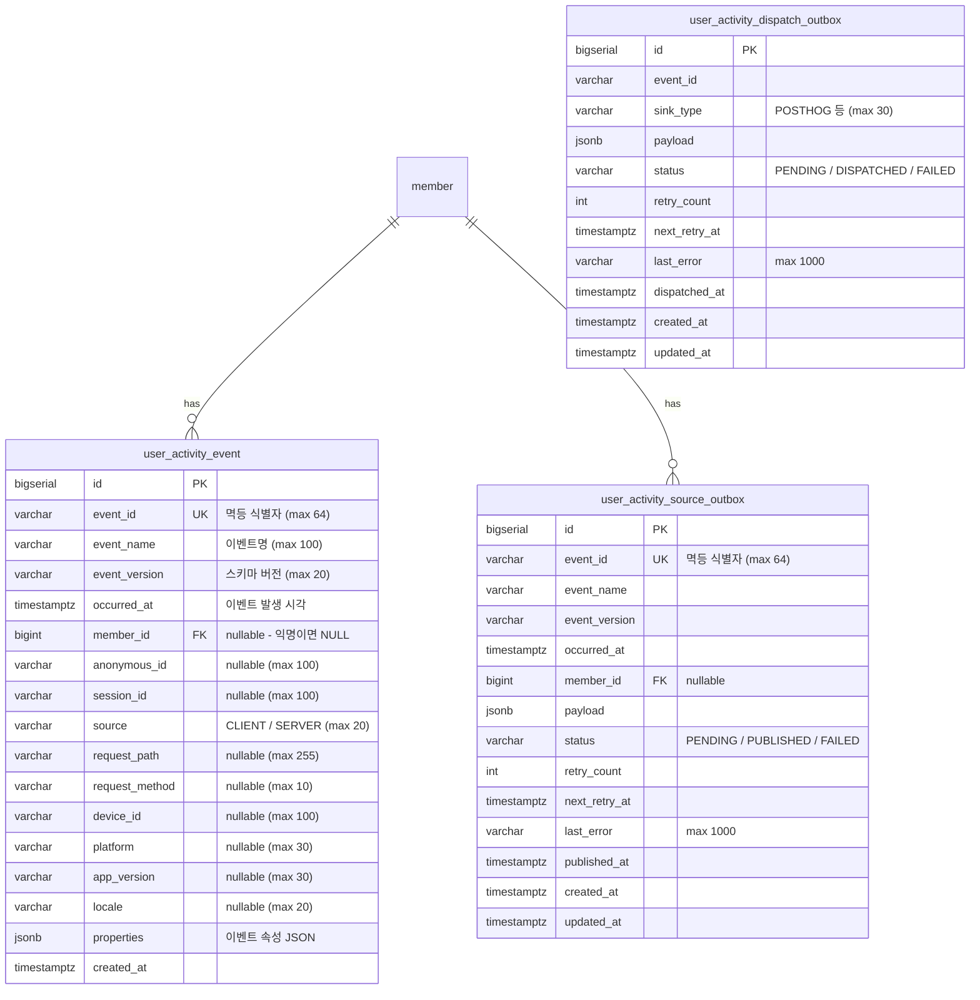

| 항목 | 내용 |
|---|---|
| 문서 제목 | 분석(Analytics) 테크 스펙 |
| 문서 목적 | 사용자 행동 이벤트 수집·저장·전송 시스템의 설계를 기록하여 구현·리뷰·운영 기준으로 사용한다 |
| 작성 및 관리 | 3-team Tasteam BE |
| 최초 작성일 | 2026.02.25 |
| 최종 수정일 | 2026.02.26 |
| 문서 버전 | v1.3 |

# 분석(Analytics) - BE 테크스펙

---

# **[1] 배경 (Background)**

## **[1-1] 프로젝트 목표 (Objective)**

사용자의 행동 데이터를 신뢰성 있게 수집·저장하여 서비스 개선 의사결정에 필요한 데이터 기반을 구축한다.

- **핵심 결과 (Key Result) 1:** 클라이언트 이벤트 유실률 1% 미만 (localStorage 큐 + keepalive flush 기준)
- **핵심 결과 (Key Result) 2:** 이벤트 수집 API p95 응답 200ms 이하
- **핵심 결과 (Key Result) 3:** PostHog 전송 성공률 99% 이상 (아웃박스 재시도 포함)

<br>

## **[1-2] 문제 정의 (Problem)**

- 서비스 내 사용자 행동(페이지 조회, 검색, 레스토랑 클릭 등)을 정량적으로 파악할 수단이 없어 기능 개선 우선순위 설정이 주관적이다.
- 사용자가 특정 기능을 얼마나 사용하는지 알 수 없어 사용성 문제를 데이터로 검증할 수 없다.
- 도메인 이벤트(리뷰 생성, 그룹 가입 등) 발생 현황을 실시간으로 확인할 수단이 없다.

<br>

## **[1-3] 가설 (Hypothesis)**

클라이언트/서버 양쪽에서 표준화된 이벤트를 수집하고 PostHog에 전송하면, 기능별 실사용 현황을 대시보드로 확인할 수 있어 데이터 기반 의사결정이 가능해진다.

<br>

---

# **[2] 목표가 아닌 것 (Non-goals)**

**이번 작업에서 다루지 않는 내용:**

- **이벤트 기반 추천 시스템:** 수집된 데이터를 ML/AI 추천 모델에 활용하는 것은 이번 범위에 포함되지 않는다.
    - 데이터 수집 인프라 구축이 우선이며, 추천 활용은 후속 과제로 진행한다.
- **관리자용 분석 대시보드 직접 개발:** 자체 대시보드 UI 개발은 진행하지 않는다.
    - PostHog SaaS 대시보드를 사용한다.
- **A/B 테스트 플랫폼:** 피처 플래그 및 실험 관리 기능은 이번 범위에 포함되지 않는다.
    - PostHog의 해당 기능은 추후 검토한다.

---

# **[3] 설계 및 기술 자료 (Architecture and Technical Documentation)**

## **[3-1] 모듈 구성 및 의존성**

- **모듈/책임 요약:**
    - `analytics/ingest`: 클라이언트 이벤트 수신, 검증, 화이트리스트 필터링, 레이트 제한, DB 저장
    - `analytics/application`: 도메인 이벤트 청취(리뷰 생성, 그룹 가입 등) → `ActivityEvent` 정규화 → Sink 전달
    - `analytics/persistence`: `user_activity_event` 저장, 아웃박스 패턴(source/dispatch outbox)
    - `analytics/dispatch`: 외부 분석 도구(PostHog 등) Sink 인터페이스 및 재시도 관리
    - `infra/posthog`: PostHog HTTP 클라이언트 구현체
- **주요 의존성:** PostgreSQL(JSONB), Caffeine Cache(레이트 제한), PostHog API
- **핵심 흐름:** 클라이언트 이벤트 수집 / 도메인 이벤트 변환 / PostHog 전송

```mermaid
%%{init: {'theme': 'base', 'themeVariables': {'fontSize': '14px', 'fontFamily': 'trebuchet ms, sans-serif', 'edgeLabelBackground': '#ffffff'}}}%%
flowchart LR
    classDef feNode   fill:#DBEAFE,stroke:#2563EB,stroke-width:2px,color:#1E3A5F,font-weight:bold
    classDef beNode   fill:#D1FAE5,stroke:#059669,stroke-width:2px,color:#064E3B
    classDef dbNode   fill:#EDE9FE,stroke:#7C3AED,stroke-width:2px,color:#2E1065
    classDef sinkNode fill:#FEF9C3,stroke:#CA8A04,stroke-width:2px,color:#78350F
    classDef extNode  fill:#FFF7ED,stroke:#EA580C,stroke-width:2px,color:#7C2D12,font-weight:bold

    FE["프론트엔드\n(ActivityDispatcher)"]:::feNode
    API["ClientActivityIngestController\nPOST /api/v1/analytics/events"]:::beNode
    SVC["ClientActivityIngestService\n· 화이트리스트 검증\n· 레이트 제한 · 정규화"]:::beNode
    STORE["UserActivityEventStoreService\n· 멱등 저장 · 아웃박스 등록"]:::beNode
    DB[("user_activity_event\n+ outbox 테이블")]:::dbNode
    LISTENER["ActivityDomainEventListener\n도메인 이벤트 감청"]:::beNode
    ORCH["ActivityEventOrchestrator\n매퍼 레지스트리"]:::beNode
    SINK["ActivitySink\n(PosthogSink 등)"]:::sinkNode
    PH["PostHog API"]:::extNode

    FE       -->|"배치 POST"| API
    API      --> SVC
    SVC      --> STORE
    STORE    --> DB
    LISTENER -->|"@TransactionalEventListener"| ORCH
    ORCH     --> STORE
    STORE    -.->|"아웃박스 poll"| SINK
    SINK     ==> PH
```



### 상세 파이프라인 구조도 (FE → BE → Outbox → 외부 Sink)

```mermaid
%%{init: {'theme': 'base', 'themeVariables': {'fontSize': '13px', 'fontFamily': 'trebuchet ms, sans-serif', 'edgeLabelBackground': '#f8fafc'}}}%%
flowchart TD
    %% ── 노드 타입별 스타일 정의 ─────────────────────────────────────
    classDef trigger  fill:#DCFCE7,stroke:#16A34A,stroke-width:2px,color:#14532D,font-weight:bold
    classDef service  fill:#DBEAFE,stroke:#2563EB,stroke-width:2px,color:#1E3A5F
    classDef decision fill:#FEF9C3,stroke:#CA8A04,stroke-width:2px,color:#713F12
    classDef storage  fill:#EDE9FE,stroke:#7C3AED,stroke-width:2px,color:#2E1065
    classDef drop     fill:#FEE2E2,stroke:#DC2626,stroke-width:2px,color:#7F1D1D
    classDef success  fill:#D1FAE5,stroke:#059669,stroke-width:2px,color:#064E3B,font-weight:bold
    classDef dlq      fill:#FCE7F3,stroke:#BE185D,stroke-width:2px,color:#500724,font-weight:bold
    classDef extapi   fill:#FEF3C7,stroke:#D97706,stroke-width:2px,color:#78350F,font-weight:bold
    classDef hook     fill:#FFF7ED,stroke:#EA580C,stroke-width:2px,color:#7C2D12
    classDef mq       fill:#E0F2FE,stroke:#0284C7,stroke-width:2px,color:#0C4A6E,font-weight:bold

    %% ── FE 클라이언트 이벤트 파이프라인 ────────────────────────────
    subgraph FE["프론트엔드  ·  PWA / ActivityDispatcher"]
        direction TB
        UA(["사용자 행동"]):::trigger
        TRACK["track(eventName, props)\n· allowlist 검증\n· 필수 속성 검증\n· 민감 속성 sanitize"]:::service
        FE_DROP["이벤트 무시\n(로그만 출력)"]:::drop
        FE_QUEUE[("localStorage 큐\nactivity:queue:v1\nActivityQueue")]:::storage
        FE_FLUSH["flush()"]:::service
        FE_RETRY["requeueFront(batch)\n지수 백오프\n3s → 6s → 12s … max 60s"]:::service
        FE_BATCH_DROP["배치 폐기\n(재시도 불가)"]:::drop
        FE_DISABLE["큐 비우기\n수집 비활성화"]:::drop

        UA          --> TRACK
        TRACK       -->|reject| FE_DROP
        TRACK       -->|pass| FE_QUEUE
        FE_QUEUE    -->|"maxBatch 도달 · flush interval\n페이지 숨김 · 언로드"| FE_FLUSH
        FE_FLUSH    -->|"429 · 5xx · offline"| FE_RETRY
        FE_FLUSH    -->|"4xx (429 제외)"| FE_BATCH_DROP
        FE_FLUSH    -->|"CLIENT_TRANSPORT_BLOCKED"| FE_DISABLE
        FE_RETRY    --> FE_QUEUE
    end

    FE_FLUSH -->|"POST /api/v1/analytics/events\nBearer · X-Anonymous-Id"| BE_CTRL

    %% ── BE 수집 계층 ─────────────────────────────────────────────
    subgraph BE_INGEST["BE  ·  수집 계층 (Ingest)"]
        direction TB
        BE_CTRL["ClientActivityIngestController\nPOST /api/v1/analytics/events"]:::service
        BE_SVC["ClientActivityIngestService"]:::service
        ALLOW{"Allowlist 검증\n13개 이벤트명\n(AnalyticsIngestProperties)"}:::decision
        ALLOW_DROP["해당 이벤트 무시"]:::drop
        RATE{"Rate Limit\n120 req/min per key\nCaffeine 슬라이딩 윈도우\nmember:{id} / anon:{id}"}:::decision
        RATE_ERR["HTTP 429\nANALYTICS_RATE_LIMIT_EXCEEDED"]:::drop

        BE_CTRL --> BE_SVC
        BE_SVC  --> ALLOW
        ALLOW   -->|reject| ALLOW_DROP
        ALLOW   -->|pass| RATE
        RATE    -->|초과| RATE_ERR
        RATE    -->|pass| STORE_SVC
    end

    %% ── BE 저장 계층 ─────────────────────────────────────────────
    subgraph BE_PERSIST["BE  ·  저장 계층 (Persist)"]
        direction TB
        STORE_SVC["UserActivityEventStoreService\n.store(event)"]:::service
        JDBC["UserActivityEventJdbcRepository\nINSERT … ON CONFLICT event_id DO NOTHING"]:::service
        DB_EVT[("user_activity_event\nPostgreSQL · JSONB\n멱등 저장 · event_id UNIQUE")]:::storage

        STORE_SVC --> JDBC
        JDBC      --> DB_EVT
    end

    %% ── Hook 체인 ────────────────────────────────────────────────
    DB_EVT -->|"저장 성공 · UserActivityStoredHook 체인"| H1 & H2

    H1["Source Outbox Hook\nUserActivitySourceOutboxService\n.enqueue(event)"]:::hook
    H2["Dispatch Outbox Hook\nUserActivityDispatchOutboxService\n.enqueue(event, POSTHOG)"]:::hook

    H1 --> SRC_TBL
    H2 --> DSP_TBL

    SRC_TBL[("user_activity_source_outbox\nstatus = PENDING  ·  event_id UNIQUE")]:::storage
    DSP_TBL[("user_activity_dispatch_outbox\nstatus = PENDING\n(event_id, dispatch_target) UNIQUE")]:::storage

    %% ── Source Outbox Replay ──────────────────────────────────────
    subgraph SRC_REPLAY["Source Outbox Replay  ·  UserActivityReplayService"]
        direction TB
        SRC_SCHED(["스케줄 태스크"]):::trigger
        SRC_CAND["findReplayCandidates(limit)\nstatus IN (PENDING, FAILED)\nnext_retry_at IS NULL OR ≤ NOW()"]:::service
        SRC_PUB["UserActivityMessageQueuePublisher\n.sink(event)"]:::service
        SRC_OK["markPublished(eventId)\nstatus = PUBLISHED"]:::success
        SRC_FAIL["markFailed(eventId, ex)\nretry_count++\nnext_retry_at = NOW() + 2^min(n,6) × 10s\nmax ≈ 640s"]:::drop

        SRC_SCHED --> SRC_CAND
        SRC_CAND  --> SRC_PUB
        SRC_PUB   -->|성공| SRC_OK
        SRC_PUB   -->|실패| SRC_FAIL
    end

    SRC_TBL  --> SRC_SCHED
    SRC_FAIL -->|"retry_count > 6"| SRC_DLQ[["DLQ 상당\nstatus = FAILED  ·  retry_count > 6\nUserActivitySourceOutboxSummary\n모니터링 알람"]]:::dlq
    SRC_FAIL -.->|"다음 폴링 주기에 재처리"| SRC_CAND
    SRC_OK   ==> MQ[("Kafka\nevt.activity.v1")]:::mq

    %% ── Dispatch Outbox Dispatcher ───────────────────────────────
    subgraph DSP_DISPATCH["Dispatch Outbox Dispatcher  ·  1분 주기 · 배치 100건"]
        direction TB
        DSP_SCHED(["스케줄 태스크"]):::trigger
        CB{"Circuit Breaker\nUserActivityDispatchCircuitBreaker"}:::decision
        CB_SKIP["전송 전량 스킵\ncircuitOpen = true"]:::drop
        DSP_CAND["findDispatchCandidates(POSTHOG, limit)\nstatus IN (PENDING, FAILED)\nnext_retry_at IS NULL OR ≤ NOW()"]:::service
        DSP_SINK["UserActivityDispatchSink\n.dispatch(event)\n→ PostHog HTTP API"]:::service
        DSP_OK["markDispatched(id)\nstatus = DISPATCHED\ncircuitBreaker.recordSuccess()"]:::success
        DSP_FAIL["markFailed(id, ex)\nretry_count++  ·  circuitBreaker.recordFailure()\nnext_retry_at = NOW() + LEAST(600s, 10s × 2^min(n,10))"]:::drop

        DSP_SCHED --> CB
        CB        -->|"OPEN  ·  연속 5회 실패 → 1분 차단"| CB_SKIP
        CB        -->|"CLOSED"| DSP_CAND
        DSP_CAND  --> DSP_SINK
        DSP_SINK  -->|성공| DSP_OK
        DSP_SINK  -->|실패| DSP_FAIL
    end

    DSP_TBL  --> DSP_SCHED
    DSP_FAIL -->|"retry_count > 10  또는  Circuit OPEN"| DSP_DLQ[["DLQ 상당\nstatus = FAILED\nCircuit OPEN 시 자동 복구 대기\n또는 수동 재처리"]]:::dlq
    DSP_FAIL -.->|"다음 폴링 주기에 재처리"| DSP_CAND
    DSP_OK   ==> POSTHOG["PostHog API\nhttps://app.posthog.com/capture/"]:::extapi

    %% ── 서버 도메인 이벤트 경로 ──────────────────────────────────
    subgraph DOMAIN["서버 도메인 이벤트 경로"]
        direction TB
        DE1(["ReviewCreatedEvent"]):::trigger
        DE2(["GroupMemberJoinedEvent"]):::trigger
        LISTENER["ActivityDomainEventListener\n@TransactionalEventListener\nphase = AFTER_COMMIT"]:::service
        ORCH["ActivityEventOrchestrator"]:::service
        MAPPER_REG["ActivityEventMapperRegistry\n도메인 이벤트 → ActivityEvent 변환"]:::service
        ASINK["ActivitySink 체인\n(Source Outbox Sink · Dispatch Outbox Sink)"]:::hook

        DE1 & DE2  --> LISTENER
        LISTENER   --> ORCH
        ORCH       --> MAPPER_REG
        MAPPER_REG --> ASINK
    end

    ASINK --> STORE_SVC

    %% ── 서브그래프 배경 스타일 ──────────────────────────────────────
    style FE           fill:#EFF6FF,stroke:#93C5FD,stroke-width:2px,color:#1E3A5F
    style BE_INGEST    fill:#ECFDF5,stroke:#6EE7B7,stroke-width:2px,color:#064E3B
    style BE_PERSIST   fill:#F5F3FF,stroke:#C4B5FD,stroke-width:2px,color:#2E1065
    style SRC_REPLAY   fill:#FFFBEB,stroke:#FDE68A,stroke-width:2px,color:#78350F
    style DSP_DISPATCH fill:#FFF7ED,stroke:#FDBA74,stroke-width:2px,color:#7C2D12
    style DOMAIN       fill:#F0FDF4,stroke:#86EFAC,stroke-width:2px,color:#14532D
```



<br>

## **[3-2] 데이터베이스 스키마 (ERD)**

- ERD Cloud: [https://www.erdcloud.com/d/TXZ3CApePpKwEyacT](https://www.erdcloud.com/d/TXZ3CApePpKwEyacT)
- ERD 테이블 정의서: [ERD 테이블 정의서](https://github.com/100-hours-a-week/3-team-tasteam-wiki/wiki/%5BERD%5D-%ED%85%8C%EC%9D%B4%EB%B8%94-%EC%A0%95%EC%9D%98%EC%84%9C)
- DDL: `app-api/src/main/resources/db/migration/V202602181100__create_user_activity_event_tables.sql`

**주요 테이블 요약**

- `user_activity_event`: 클라이언트·서버 행동 이벤트 원본 저장소
- `user_activity_source_outbox`: 서버 사실 이벤트 발행 보장용 소스 아웃박스 (PENDING → PUBLISHED/FAILED)
- `user_activity_dispatch_outbox`: 외부 분석 도구(PostHog 등) 전송용 디스패치 아웃박스 (PENDING → SENT/FAILED)

**관계 요약**

- `user_activity_event.member_id` → `member.id` (N:1, RESTRICT, nullable - 익명 사용자면 NULL)
- `user_activity_source_outbox.member_id` → `member.id` (N:1, RESTRICT, nullable)

**ERD (Mermaid)**



**테이블 정의서**

#### `user_activity_event`

| 컬럼 | 타입 | Nullable | 기본값 | 설명 | 제약/고려사항 |
|---|---|---|---|---|---|
| `id` | `BIGSERIAL` | N | auto | 내부 식별자 | PK |
| `event_id` | `VARCHAR(64)` | N | - | 클라이언트 생성 UUID | UNIQUE, 멱등 저장 기준 |
| `event_name` | `VARCHAR(100)` | N | - | 이벤트명 (e.g. `ui.page.viewed`) | NOT NULL |
| `event_version` | `VARCHAR(20)` | N | - | 스키마 버전 (e.g. `v1`) | NOT NULL |
| `occurred_at` | `TIMESTAMPTZ` | N | - | 이벤트 발생 시각 (클라이언트 기준) | NOT NULL |
| `member_id` | `BIGINT` | Y | NULL | 로그인 사용자 ID | FK → member(id), nullable |
| `anonymous_id` | `VARCHAR(100)` | Y | NULL | 비로그인 익명 ID (localStorage 유지) | nullable |
| `session_id` | `VARCHAR(100)` | Y | NULL | 세션 ID (sessionStorage, 탭 단위) | nullable |
| `source` | `VARCHAR(20)` | N | - | `CLIENT` 또는 `SERVER` | NOT NULL |
| `request_path` | `VARCHAR(255)` | Y | NULL | 수신 시 서버 경로 | nullable |
| `request_method` | `VARCHAR(10)` | Y | NULL | HTTP 메서드 | nullable |
| `device_id` | `VARCHAR(100)` | Y | NULL | 기기 식별자 | nullable |
| `platform` | `VARCHAR(30)` | Y | NULL | 플랫폼 (e.g. `web`) | nullable |
| `app_version` | `VARCHAR(30)` | Y | NULL | 앱 버전 | nullable |
| `locale` | `VARCHAR(20)` | Y | NULL | 사용자 언어/지역 | nullable |
| `properties` | `JSONB` | N | `'{}'` | 이벤트별 속성 JSON | NOT NULL |
| `created_at` | `TIMESTAMPTZ` | N | `NOW()` | 서버 저장 시각 | NOT NULL |

**주요 인덱스**

| 테이블 | 인덱스 명 | 컬럼 | 목적 |
|---|---|---|---|
| `user_activity_event` | `uq_user_activity_event_event_id` | `event_id` | 멱등 중복 방지 |
| `user_activity_event` | `idx_user_activity_event_member_occurred` | `(member_id, occurred_at DESC)` | 사용자별 이벤트 조회 |
| `user_activity_event` | `idx_user_activity_event_name_occurred` | `(event_name, occurred_at DESC)` | 이벤트명별 집계 |
| `user_activity_event` | `idx_user_activity_event_occurred` | `(occurred_at DESC)` | 전체 시계열 조회 |

#### `user_activity_source_outbox`

| 컬럼 | 타입 | Nullable | 기본값 | 설명 | 제약/고려사항 |
|---|---|---|---|---|---|
| `id` | `BIGSERIAL` | N | auto | PK | |
| `event_id` | `VARCHAR(64)` | N | - | 이벤트 고유 식별자 | UNIQUE |
| `event_name` | `VARCHAR(100)` | N | - | 이벤트명 | NOT NULL |
| `event_version` | `VARCHAR(20)` | N | - | 스키마 버전 | NOT NULL |
| `occurred_at` | `TIMESTAMPTZ` | N | - | 이벤트 발생 시각 | NOT NULL |
| `member_id` | `BIGINT` | Y | NULL | 사용자 ID | FK → member(id), nullable |
| `payload` | `JSONB` | N | - | 전송할 전체 페이로드 | NOT NULL |
| `status` | `VARCHAR(20)` | N | `PENDING` | `PENDING` / `PUBLISHED` / `FAILED` | NOT NULL |
| `retry_count` | `INTEGER` | N | `0` | 재시도 횟수 | NOT NULL |
| `next_retry_at` | `TIMESTAMPTZ` | Y | NULL | 다음 재시도 예정 시각 | nullable |
| `last_error` | `VARCHAR(1000)` | Y | NULL | 마지막 오류 메시지 | nullable |
| `published_at` | `TIMESTAMPTZ` | Y | NULL | 발행 완료 시각 | nullable |
| `created_at` | `TIMESTAMPTZ` | N | `NOW()` | 생성 시각 | NOT NULL |
| `updated_at` | `TIMESTAMPTZ` | N | `NOW()` | 수정 시각 | NOT NULL |

#### `user_activity_dispatch_outbox`

| 컬럼 | 타입 | Nullable | 기본값 | 설명 | 제약/고려사항 |
|---|---|---|---|---|---|
| `id` | `BIGSERIAL` | N | auto | PK | |
| `event_id` | `VARCHAR(64)` | N | - | 이벤트 식별자 | UNIQUE with sink_type |
| `sink_type` | `VARCHAR(30)` | N | - | `POSTHOG` 등 대상 식별자 | NOT NULL |
| `payload` | `JSONB` | N | - | 전송 페이로드 | NOT NULL |
| `status` | `VARCHAR(20)` | N | `PENDING` | `PENDING` / `DISPATCHED` / `FAILED` | NOT NULL |
| `retry_count` | `INTEGER` | N | `0` | 재시도 횟수 | NOT NULL |
| `next_retry_at` | `TIMESTAMPTZ` | Y | NULL | 다음 재시도 예정 시각 | nullable |
| `last_error` | `VARCHAR(1000)` | Y | NULL | 마지막 오류 메시지 | nullable |
| `dispatched_at` | `TIMESTAMPTZ` | Y | NULL | 전송 완료 시각 | nullable |
| `created_at` | `TIMESTAMPTZ` | N | `NOW()` | 생성 시각 | NOT NULL |
| `updated_at` | `TIMESTAMPTZ` | N | `NOW()` | 수정 시각 | NOT NULL |

**주요 인덱스**

| 테이블 | 인덱스 명 | 컬럼 | 목적 |
|---|---|---|---|
| `user_activity_dispatch_outbox` | `uq_user_activity_dispatch_outbox_event_sink` | `(event_id, sink_type)` | Sink별 중복 전송 방지 |
| `user_activity_dispatch_outbox` | `idx_user_activity_dispatch_outbox_status_retry` | `(status, next_retry_at, id)` | 재시도 폴링 |
| `user_activity_dispatch_outbox` | `idx_user_activity_dispatch_outbox_sink_status` | `(sink_type, status, id)` | Sink별 처리 상태 조회 |

<br>

## **[3-3] API 명세 (API Specifications)**

- **목차:**
    - [클라이언트 이벤트 수집 (POST /api/v1/analytics/events)](#클라이언트-이벤트-수집-api)

<br>

---

### **클라이언트 이벤트 수집 API**

- **API 명세:**
    - `POST /api/v1/analytics/events`
    - API 문서 링크: Swagger `/swagger-ui.html` → Analytics 태그
- **권한:**
    - 선택적 인증 (`@CurrentUser` nullable): 로그인 사용자면 `memberId` 연결, 비로그인이면 `anonymousId`로 식별
- **구현 상세:**
    - **요청**
        - **Headers:**
            - `Authorization`: string (선택, Bearer JWT) - 로그인 사용자 식별
            - `X-Anonymous-Id`: string (선택, max 100) - 비로그인 사용자 기기 식별자
        - **Request Body**
            - content-type: `application/json`
            - 스키마(필드 정의)
                - `anonymousId`: string (선택, max 100) - 익명 사용자 ID
                - `events`: array (필수, min 1) - 이벤트 목록
                    - `events[].eventId`: string (필수) - 클라이언트 생성 UUID v4, 멱등 키
                    - `events[].eventName`: string (필수) - 화이트리스트에 속한 이벤트명 (아래 이벤트 카탈로그 참고)
                    - `events[].eventVersion`: string (선택, 기본값: `v1`) - 스키마 버전
                    - `events[].occurredAt`: string (선택, ISO-8601 UTC) - 이벤트 발생 시각, 없으면 서버 수신 시각 사용
                    - `events[].properties`: object (필수) - 이벤트별 속성 (민감 속성 자동 필터링)
            - 예시(JSON)
                ```json
                {
                  "anonymousId": "anon_xK2mQpLv9c",
                  "events": [
                    {
                      "eventId": "01952b4e-7a2c-7d3e-8f90-abc123def456",
                      "eventName": "ui.page.viewed",
                      "eventVersion": "v1",
                      "occurredAt": "2026-02-25T09:00:00.000Z",
                      "properties": {
                        "pageKey": "home",
                        "pathTemplate": "/",
                        "referrerPathTemplate": null,
                        "sessionId": "sess_abc123"
                      }
                    },
                    {
                      "eventId": "01952b4e-8b3d-7e4f-9a01-bcd234ef5678",
                      "eventName": "ui.restaurant.clicked",
                      "eventVersion": "v1",
                      "occurredAt": "2026-02-25T09:00:15.000Z",
                      "properties": {
                        "restaurantId": 101,
                        "fromPageKey": "home",
                        "position": 2
                      }
                    }
                  ]
                }
                ```
    - **응답**
        - status: `200`
        - body 스키마
            - `data.acceptedCount`: number - 실제로 수락(저장 시도)된 이벤트 수
        - 예시(JSON)
            ```json
            {
              "data": {
                "acceptedCount": 2
              }
            }
            ```
    - **처리 로직:**
        1. 요청 파싱 및 Bean Validation (`@NotEmpty events`, `@NotBlank eventId/eventName`)
        2. 레이트 제한 확인 (Caffeine 슬라이딩 윈도우, 기본 120 req/min per user/device)
        3. 화이트리스트 필터링 — 허용 목록(`allowlist`)에 없는 `eventName`은 무시
        4. `ActivityEvent`(정규화 내부 레코드)로 변환: `memberId` (인증 시), `anonymousId`, `source=CLIENT` 주입
        5. `UserActivityEventStoreService.insertIgnoreDuplicate()` 호출 — `eventId` UNIQUE 충돌 시 skip (멱등)
        6. 저장 후 hook 실행 (dispatch outbox 등록)
        7. 수락 건수 응답
    - **트랜잭션 관리:** 이벤트별 개별 저장 (배치 insert, 부분 실패 시 나머지 계속 처리)
    - **동시성/멱등성:** `event_id` UNIQUE 제약으로 중복 전송 자동 무시 (`INSERT ... ON CONFLICT DO NOTHING`)

---

### **도메인 이벤트 → 분석 이벤트 변환 (내부 처리)**

클라이언트 API와 별도로, Spring 도메인 이벤트 발행 시 자동으로 분석 이벤트를 생성한다.

| 도메인 이벤트 | 생성 분석 이벤트명 | 속성 |
|---|---|---|
| `ReviewCreatedEvent` | `review.created` | `{ restaurantId }` |
| `GroupMemberJoinedEvent` | `group.joined` | `{ groupId, groupName }` |

- **리스너:** `ActivityDomainEventListener` - `@TransactionalEventListener(phase = AFTER_COMMIT)`
- **흐름:** 도메인 트랜잭션 커밋 후 → `ActivityEventOrchestrator` → `ActivityEventMapperRegistry` → 매퍼 선택 → `ActivityEvent` 생성 → `UserActivityEventStoreService` 저장

<br>

## **[3-4] 이벤트 카탈로그 (Event Catalog)**

수집 중인 모든 이벤트 목록과 필수 속성을 정의한다.

### 클라이언트 이벤트 (source: CLIENT)

| 이벤트명 | 설명 | 필수 속성 |
|---|---|---|
| `ui.page.viewed` | 페이지 조회 | `pageKey`, `pathTemplate`, `referrerPathTemplate`, `sessionId` |
| `ui.page.dwelled` | 페이지 체류 완료 | `pageKey`, `pathTemplate`, `dwellMs`, `exitType`, `sessionId` |
| `ui.restaurant.clicked` | 레스토랑 목록에서 클릭 | `restaurantId`, `fromPageKey`, `position` |
| `ui.restaurant.viewed` | 레스토랑 상세 페이지 진입 | `restaurantId`, `fromPageKey` |
| `ui.review.write_started` | 리뷰 작성 시작 | `restaurantId`, `fromPageKey` |
| `ui.review.submitted` | 리뷰 제출 완료 | `restaurantId`, `groupId`, `subgroupId` |
| `ui.search.executed` | 검색 실행 | `fromPageKey`, `resultRestaurantCount`, `resultGroupCount`, `queryLength`, `hasFilter` |
| `ui.group.clicked` | 그룹 클릭 | `groupId`, `fromPageKey` |
| `ui.favorite.sheet_opened` | 즐겨찾기 시트 열기 | `restaurantId`, `fromPageKey` |
| `ui.favorite.updated` | 즐겨찾기 변경 | `restaurantId`, `selectedTargetCount`, `fromPageKey` |
| `ui.event.clicked` | 이벤트/배너 클릭 | `eventId`, `fromPageKey` |
| `ui.tab.changed` | 하단 탭 변경 | `fromTab`, `toTab`, `fromPageKey` |
| `ui.restaurant.shared` | 레스토랑 공유 | `restaurantId`, `fromPageKey`, `shareMethod` |

### 서버 이벤트 (source: SERVER)

| 이벤트명 | 트리거 | 속성 |
|---|---|---|
| `review.created` | 리뷰 저장 트랜잭션 커밋 후 | `{ restaurantId }` |
| `group.joined` | 그룹 멤버 가입 트랜잭션 커밋 후 | `{ groupId, groupName }` |

### 이벤트 속성 상세

#### `ui.page.viewed`

| 속성 | 타입 | 설명 |
|---|---|---|
| `pageKey` | string | 페이지 식별자 (e.g. `home`, `restaurant-detail`) |
| `pathTemplate` | string | 정규화된 경로 (e.g. `/restaurants/:id`) |
| `referrerPathTemplate` | string \| null | 이전 페이지 경로 |
| `sessionId` | string | 탭 단위 세션 ID |

#### `ui.page.dwelled`

| 속성 | 타입 | 설명 |
|---|---|---|
| `pageKey` | string | 페이지 식별자 |
| `pathTemplate` | string | 정규화된 경로 |
| `dwellMs` | number | 체류 시간 (밀리초) |
| `exitType` | string | `navigate` / `hidden` / `unload` |
| `sessionId` | string | 탭 단위 세션 ID |

#### `ui.restaurant.clicked`

| 속성 | 타입 | 설명 |
|---|---|---|
| `restaurantId` | number | 레스토랑 ID |
| `fromPageKey` | string | 클릭 출처 페이지 키 |
| `position` | number | 목록 내 노출 순서 (1-indexed) |

#### `ui.restaurant.viewed`

| 속성 | 타입 | 설명 |
|---|---|---|
| `restaurantId` | number | 레스토랑 ID |
| `fromPageKey` | string | 진입 출처 페이지 키 |

#### `ui.review.write_started`

| 속성 | 타입 | 설명 |
|---|---|---|
| `restaurantId` | number | 리뷰 대상 레스토랑 ID |
| `fromPageKey` | string | 작성 버튼 클릭 출처 페이지 키 |

#### `ui.review.submitted`

| 속성 | 타입 | 설명 |
|---|---|---|
| `restaurantId` | number | 리뷰 대상 레스토랑 ID |
| `groupId` | number | 소속 그룹 ID |
| `subgroupId` | number \| null | 소속 서브그룹 ID |

#### `ui.search.executed`

| 속성 | 타입 | 설명 |
|---|---|---|
| `fromPageKey` | string | 검색 출처 페이지 키 |
| `resultRestaurantCount` | number | 레스토랑 결과 수 |
| `resultGroupCount` | number | 그룹 결과 수 |
| `queryLength` | number | 검색어 길이 (내용 미수집, 프라이버시 보호) |
| `hasFilter` | boolean | 필터 적용 여부 |

#### `ui.group.clicked`

| 속성 | 타입 | 설명 |
|---|---|---|
| `groupId` | number | 그룹 ID |
| `fromPageKey` | string | 클릭 출처 페이지 키 |

#### `ui.favorite.sheet_opened`

| 속성 | 타입 | 설명 |
|---|---|---|
| `restaurantId` | number | 대상 레스토랑 ID |
| `fromPageKey` | string | 시트 열기 출처 페이지 키 |

#### `ui.favorite.updated`

| 속성 | 타입 | 설명 |
|---|---|---|
| `restaurantId` | number | 대상 레스토랑 ID |
| `selectedTargetCount` | number | 선택된 즐겨찾기 수 (0이면 전체 해제) |
| `fromPageKey` | string | 출처 페이지 키 |

#### `ui.event.clicked`

| 속성 | 타입 | 설명 |
|---|---|---|
| `eventId` | string | 이벤트/배너 콘텐츠 ID |
| `fromPageKey` | string | 클릭 출처 페이지 키 |

#### `ui.tab.changed`

| 속성 | 타입 | 설명 |
|---|---|---|
| `fromTab` | string | 이전 탭 식별자 |
| `toTab` | string | 이동한 탭 식별자 |
| `fromPageKey` | string | 탭 변경 시 현재 페이지 키 |

#### `ui.restaurant.shared`

| 속성 | 타입 | 설명 |
|---|---|---|
| `restaurantId` | number | 공유된 레스토랑 ID |
| `fromPageKey` | string | 공유 발생 출처 페이지 키 (`restaurant-detail`) |
| `shareMethod` | `'native'` \| `'clipboard'` | 공유 수단 — `native`: Web Share API, `clipboard`: 링크 복사 |

<br>

## **[3-5] 도메인 에러 코드**

| code | status | 의미 | retryable | 비고 |
|---|---:|---|---|---|
| `INVALID_REQUEST` | 400 | 요청 필드 validation 실패 | no | `errors[]` 포함 |
| `ANALYTICS_RATE_LIMIT_EXCEEDED` | 429 | 레이트 제한 초과 | yes | 클라이언트 지수 백오프 재시도 |
| `INTERNAL_SERVER_ERROR` | 500 | 서버 오류 | yes | 관측/알람 |

<br>

## **[3-6] 기술 스택 (Technology Stack)**

- **Backend:** Java 21 / Spring Boot 3.5.9
- **Database:** PostgreSQL + JSONB (`user_activity_event`, outbox 테이블)
- **Cache:** Caffeine (레이트 제한 슬라이딩 윈도우)
- **External:** PostHog (`https://app.posthog.com/capture/`)
- **PostHog 파이프라인 활성 조건:** `tasteam.analytics.posthog.enabled=true` 설정 시에만 `UserActivityDispatchOutboxEnqueueHook`과 `UserActivityDispatchScheduler`가 Bean으로 등록된다. 기본값 `false` — 로컬/개발 환경에서는 dispatch outbox 등록 및 PostHog 전송이 완전 비활성.
- **Frontend:** React 19, TypeScript, localStorage 기반 이벤트 큐

<br>

---

# **[4] 이외 고려사항들 (Other Considerations)**

## **[4-1] 고려사항 체크리스트**

- **성능:**
    - 이벤트 저장은 JDBC Batch Insert로 처리하여 DB 왕복 최소화
    - `user_activity_event` 테이블은 append-only이므로 인덱스 선택적 생성 (쓰기 성능 우선)
    - 레이트 제한은 Caffeine 인메모리로 처리 (Redis 없이 단일 인스턴스 기준)
- **데이터 정합성:**
    - `eventId` UNIQUE 제약으로 클라이언트 중복 전송 자동 멱등 처리
    - 아웃박스 패턴으로 PostHog 전송 실패 시 재시도 보장 (지수 백오프)
    - 도메인 이벤트는 `@TransactionalEventListener(AFTER_COMMIT)`으로 비즈니스 트랜잭션 완료 후 처리
    - Dispatch Outbox 등록 Hook(`UserActivityDispatchOutboxEnqueueHook`)은 `@Transactional(REQUIRES_NEW)`로 실행되어 이벤트 저장 트랜잭션과 분리된다. 저장 성공 후 hook 호출 전에 프로세스가 비정상 종료되면 dispatch outbox에 등록되지 않은 이벤트가 발생할 수 있다.
    - Hook 실행 중 예외가 발생해도 `UserActivityEventStoreService`가 catch 후 로그만 출력하고 전파하지 않으므로, dispatch outbox 등록 실패가 API 응답에 영향을 주지 않는다.
- **보안/프라이버시:**
    - 클라이언트에서 전송 전에 민감 속성 키 필터링: `query`, `keyword`, `content`, `reviewtext`, `address`, `phonenumber`, `imageurl` 등
    - `eventName` 화이트리스트로 임의 이벤트 주입 방지
    - PostHog API 키는 환경 변수(`tasteam.analytics.posthog.apiKey`)로 관리
    - `searchQuery` 등 실제 검색어는 수집하지 않고 `queryLength`(길이)만 수집

<br>

## **[4-2] 리스크 및 대응 (Risks & Mitigations)**

- **리스크:** 레이트 제한이 인메모리(Caffeine)이므로 다중 인스턴스 환경에서 인스턴스별로 각각 120 req/min이 허용된다.
  **제안:** 다중 인스턴스 환경에서는 Redis Lua 스크립트 기반 분산 레이트 제한으로 교체한다.
  **관측:** 인스턴스 수 × 120 이상의 급증 트래픽 감지 시 → **대응:** Redis 기반 레이트 리미터로 교체

- **리스크:** PostHog API 장애 시 `dispatch_outbox` 레코드가 누적되어 재시도 폴링 부하가 증가할 수 있다.
  **제안:** `retry_count` 상한(e.g. 5회)을 두고 `FAILED` 처리 후 알람 발송, 수동 재처리 운영 절차를 마련한다.
  **관측:** `status=FAILED AND retry_count >= 5` 건수 임계치(e.g. 100건) → **대응:** Slack 알람 + 수동 재처리 스크립트 실행

- **리스크:** 클라이언트 `occurredAt`은 사용자 기기 시계 기준이므로 크게 어긋난 값이 저장될 수 있다.
  **제안:** 서버 수신 시각과의 차이가 일정 범위(e.g. ±24h)를 초과하면 서버 시각으로 대체한다.
  **관측:** `occurred_at`과 `created_at` 차이가 24h 초과인 비율 → **대응:** 허용 오차 초과 시 서버 시각 사용

<br>

---

# **[5] 테스트 (Testing)**

- **이 도메인에서 테스트해야 하는 것**
    - 화이트리스트에 없는 이벤트명은 저장되지 않음
    - 동일 `eventId` 중복 전송 시 두 번째 요청은 저장 skip (멱등)
    - 레이트 제한 초과 시 429 응답
    - 도메인 이벤트(`ReviewCreatedEvent`, `GroupMemberJoinedEvent`) 발행 후 분석 이벤트 저장 확인
    - PostHog 전송 실패 시 `dispatch_outbox` 재시도 로직

- **테스트에 필요한 준비물**
    - 테스트 데이터: `event_id=UUID`, `event_name=ui.page.viewed`, 최소 properties
    - 테스트 더블: PostHog HTTP 클라이언트 Mock (실제 API 호출 방지)
    - 테스트 인프라: Testcontainers PostgreSQL (UNIQUE 제약 검증)

- **핵심 시나리오**
    1. Given: 로그인 사용자 / When: `ui.page.viewed` 이벤트 1건 전송 / Then: `user_activity_event`에 `member_id` 연결하여 저장
    2. Given: 동일 `eventId`로 2회 전송 / When: 두 번째 POST / Then: `acceptedCount=0`, DB 중복 없음
    3. Given: 화이트리스트 외 이벤트명(`ui.unknown.event`) / When: POST / Then: `acceptedCount=0`, 저장 없음

<br>

---

# **[6] 함께 논의하고 싶은 내용 (Open Questions)**

- **레이트 제한 키 기준:**
    - 현재 `memberId` 또는 `anonymousId` 단위로 제한하고 있으나, IP 기준 추가 여부 검토 필요.
    - 대안: IP만 / memberId만 / IP + memberId 조합 / 현행 유지
    - 권장안: 현행 유지 (IP 기반은 NAT 환경에서 정상 사용자 차단 위험)

- **이벤트 데이터 보관 기간:**
    - `user_activity_event` 테이블의 파티셔닝/아카이빙 정책 미결정.
    - 데이터 증가에 따른 보관 기간(e.g. 6개월/1년) 및 파기 기준 합의 필요.

- **다중 인스턴스 레이트 제한:**
    - 현재 Caffeine 인메모리 → 스케일아웃 시 Redis로 교체 여부 결정 필요.
    - 결정 필요일: 서비스 다중 인스턴스 배포 전

<br>

---

# **[7] 용어 정의 (Glossary)**

- **도메인 이벤트 상태 (Outbox Status):**
    - `PENDING`: 처리 대기 중
    - `PUBLISHED` (Source Outbox) / `DISPATCHED` (Dispatch Outbox): 전송 완료
    - `FAILED`: 최대 재시도 초과 실패
- **eventId:** 클라이언트가 생성하는 UUID v4. 서버에서 멱등 처리의 기준 키.
- **anonymousId:** 비로그인 사용자를 기기 단위로 식별하는 ID. localStorage에 영구 저장.
- **sessionId:** 탭/세션 단위 식별자. sessionStorage에 저장되어 탭을 닫으면 만료.
- **source:** 이벤트 발생 출처. `CLIENT`(프론트엔드 직접 수집) / `SERVER`(도메인 이벤트 변환).
- **Outbox Pattern:** DB 트랜잭션 내에 이벤트를 아웃박스 테이블에 함께 저장하고, 별도 폴러가 이를 읽어 외부로 전송하는 패턴. 전송 실패 시에도 재시도 보장.
- **ActivitySink:** 분석 이벤트를 외부 시스템으로 전달하는 출력 어댑터 인터페이스. 현재 구현체: `PosthogSink`.
- **allowlist:** 수집 허용된 이벤트명 목록. 목록 외 이벤트는 서버에서 무시.

<br>

---

# **[9] 미구현 항목 추적 (Unimplemented Design Items)**

설계 문서에는 존재하나 아직 구현되지 않은 항목을 기록한다.
구현 완료 시 해당 항목을 삭제하고 변경이력에 반영한다.

---

## **[9-1] Analytics 테크스펙 기준 미구현**

### ① DLQ 미구현

파이프라인 다이어그램에 `DLQ 상당`으로 표기된 케이스의 실제 동작:

| 구분 | 다이어그램 표현 | 실제 동작 |
|---|---|---|
| Source Outbox | `retry_count > 6` → DLQ 상당 | 별도 상태 전환 없음. 지수 백오프가 최대값(≈640 s)에 고정된 채 `status=FAILED`로 계속 폴링됨 |
| Dispatch Outbox | `retry_count > 10` → DLQ 상당 | 동일. `next_retry_at = NOW() + 600 s` 고정 후 재시도 무한 반복 |

실질적 DLQ(격리 상태 전환 또는 별도 테이블)는 미구현.
운영 중 고재시도 레코드 식별은 `retry_count`로 수동 조회해야 한다.

---

## **[9-2] 비동기 아키텍처 테크스펙 기준 미구현**

비동기 아키텍처 테크스펙에 정의되어 있으나 Analytics 도메인에 아직 적용되지 않은 항목.

### ① Inbox 패턴 미구현

비동기 스펙은 consumer 측 중복 방지를 위한 `consumed_event` 테이블(Inbox Pattern)을 정의한다.
Analytics 구현에는 해당 테이블이 없으며, 멱등성은 `user_activity_event.event_id UNIQUE` + `ON CONFLICT DO NOTHING`으로만 처리한다.

### ② Source Outbox → Kafka 연동 미완

비동기 스펙은 `evt.activity.v1` 토픽 기반 완전한 Kafka 파이프라인(재시도 토픽 `evt.activity.v1.retry-*`, DLQ 토픽 `evt.activity.v1.dlq`)을 정의한다.
현재 상태:

- `user_activity_source_outbox` 테이블과 `UserActivityReplayService`는 구현됨.
- 실제 Kafka 발행(`UserActivityMessageQueuePublisher`)은 `tasteam.message-queue.enabled=true` 시에만 동작, 기본값 미활성.
- 재시도·DLQ 토픽 구독/발행 로직 미구현.

### ③ eventId UUIDv7 규약 미적용

비동기 스펙은 eventId를 UUIDv7(RFC 9562) 형식으로 강제하고 regex 검증을 명시한다.
클라이언트 이벤트의 eventId는 UUID v4 예시 기준으로 문서화되어 있으며, 서버 측 형식 강제 검증이 없다.

<br>

---

# **[8] 변경이력**

| 버전 | 일자 | 작성자 | 변경 내역 | 비고 |
|---|---|---|---|---|
| `v1.0` | `2026.02.25` | Tasteam BE | 문서 초안 작성 | - |
| `v1.1` | `2026.02.26` | Tasteam BE/FE | 상세 파이프라인 Mermaid 다이어그램 추가, `ui.restaurant.shared` 이벤트 카탈로그 반영 | - |
| `v1.2` | `2026.02.26` | Tasteam BE | dispatch outbox 상태값 `SENT` → `DISPATCHED` 수정, Mermaid allowlist 개수 오류 수정(14→13), `[9]` 설계-구현 정합성 노트 추가 | - |
| `v1.3` | `2026.02.26` | Tasteam BE | Hook 트랜잭션 분리·예외 처리 동작 [4-1] 반영, PostHog 조건부 활성화 [3-6] 반영, [9] 미구현 항목 추적으로 재구성 | - |
