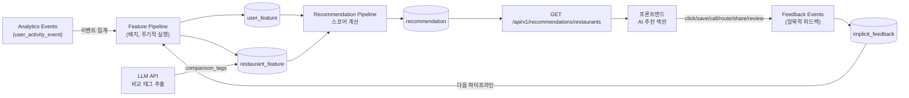
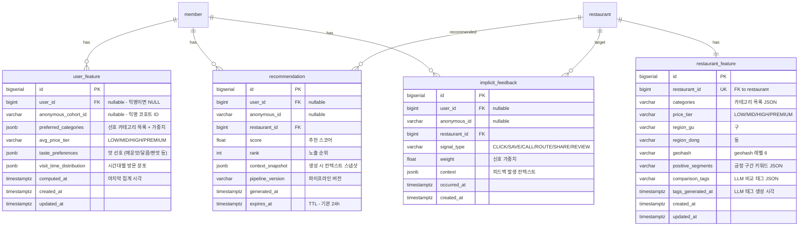

| 항목 | 내용 |
|---|---|
| 문서 제목 | 추천(Recommendation) 테크 스펙 |
| 문서 목적 | AI 기반 개인화 음식점 추천 시스템의 피처·피드백·API·파이프라인 설계를 기록하여 구현·리뷰·운영 기준으로 사용한다 |
| 작성 및 관리 | 3-team Tasteam BE |
| 최초 작성일 | 2026.02.25 |
| 최종 수정일 | 2026.02.25 |
| 문서 버전 | v1.0 |

# 추천(Recommendation) - BE 테크스펙

---

# **[1] 배경 (Background)**

## **[1-1] 프로젝트 목표 (Objective)**

사용자 행동·선호·컨텍스트 데이터를 결합한 개인화 추천으로 음식점 탐색 시간을 줄이고 클릭·저장 전환율을 높인다.

- **핵심 결과 (Key Result) 1:** 추천 섹션 CTR(클릭률) 일반 목록 대비 20% 이상
- **핵심 결과 (Key Result) 2:** 추천 음식점 찜(save) 전환율 10% 이상
- **핵심 결과 (Key Result) 3:** 피처 파이프라인 지연 p95 5분 이내 (배치 기준)

<br>

## **[1-2] 문제 정의 (Problem)**

- 현재 홈 화면의 음식점 노출은 정렬 기준이 단순하여 사용자 개인 취향이 반영되지 않는다.
- 사용자가 원하는 음식점을 찾으려면 검색 또는 다수의 스크롤이 필요하여 탐색 피로가 발생한다.
- 기존에 구축된 `분석(Analytics)` 이벤트 데이터가 있으나 추천 모델 입력으로 활용되지 않고 있다.

<br>

## **[1-3] 가설 (Hypothesis)**

사용자의 행동 이력(클릭·찜·리뷰·길찾기)과 컨텍스트(위치·시간대·요일)를 피처로 사용하면 개인 취향에 맞는 음식점을 상위에 노출할 수 있고, 이는 클릭률 및 저장 전환율 향상으로 이어진다.

<br>

---

# **[2] 목표가 아닌 것 (Non-goals)**

**이번 작업에서 다루지 않는 내용:**

- **소셜 추천 (친구 기반 CF):** 팔로우/친구 관계 데이터가 없어 이번 범위에서 제외한다.
    - 그룹 내 멤버 행동 기반 추천은 후속 과제로 검토한다.
- **실시간(온라인) 추론:** 요청 시점에 모델을 직접 호출하는 온라인 서빙은 이번 범위에 포함하지 않는다.
    - 배치 사전 계산(precomputed) 방식으로 먼저 구현하고, 온라인 서빙은 이후에 검토한다.
- **메뉴 단위 추천:** 음식점 단위 추천만 다루며, 메뉴/음식 단위 추천은 이번 범위 외다.
- **가격 비교 기능 UI 신규 개발:** 비교 태그(comparison_tags)는 추천 스코어링 입력으로만 사용하며, 별도 비교 화면은 만들지 않는다.

---

# **[3] 설계 및 기술 자료 (Architecture and Technical Documentation)**

## **[3-1] 모듈 구성 및 의존성**

- **모듈/책임 요약:**
    - `recommendation/feature`: 사용자·아이템·컨텍스트 피처 수집·가공·저장 (Feature Store)
    - `recommendation/pipeline`: 배치 파이프라인 — 피처 조합 → 스코어 계산 → 추천 결과 저장
    - `recommendation/serving`: 추천 조회 API, 캐시 레이어
    - `recommendation/feedback`: 암묵적 피드백 이벤트 수집 및 가중치 적용
    - `infra/llm`: LLM 클라이언트 (비교 태그 추출용)
- **주요 의존성:** PostgreSQL (피처·추천 저장), Analytics 이벤트(피드백 소스), LLM API (비교 태그), Caffeine/Redis (추천 캐시)
- **핵심 흐름:**
    1. **피처 파이프라인:** Analytics 이벤트 집계 → user_feature / restaurant_feature 갱신
    2. **추천 생성:** 피처 조합 → 스코어 계산 → recommendation 테이블 저장
    3. **서빙:** 클라이언트 요청 → 캐시 조회 → DB fallback → 응답
    4. **피드백 루프:** 피드백 이벤트 저장 → 다음 파이프라인 입력



<br>

## **[3-2] 데이터베이스 스키마 (ERD)**

- ERD Cloud: [https://www.erdcloud.com/d/TXZ3CApePpKwEyacT](https://www.erdcloud.com/d/TXZ3CApePpKwEyacT)
- ERD 테이블 정의서: [ERD 테이블 정의서](https://github.com/100-hours-a-week/3-team-tasteam-wiki/wiki/%5BERD%5D-%ED%85%8C%EC%9D%B4%EB%B8%94-%EC%A0%95%EC%9D%98%EC%84%9C)

**주요 테이블 요약**

- `user_feature`: 사용자별 집계된 선호 피처 (배치 갱신)
- `restaurant_feature`: 음식점별 정적·동적 피처 (LLM 태그 포함)
- `recommendation`: 사전 계산된 사용자별 추천 결과 (TTL 기반 만료)
- `implicit_feedback`: 추천 노출 후 수집된 암묵적 피드백 이벤트

**관계 요약**

- `user_feature.user_id` → `member.id` (N:1, RESTRICT, nullable — 익명 사용자는 `anonymous_cohort_id` 사용)
- `restaurant_feature.restaurant_id` → `restaurant.id` (1:1, CASCADE)
- `recommendation.user_id` → `member.id` (N:1, nullable)
- `recommendation.restaurant_id` → `restaurant.id` (N:1, RESTRICT)
- `implicit_feedback.restaurant_id` → `restaurant.id` (N:1, RESTRICT)

**ERD (Mermaid)**



**테이블 정의서**

#### `user_feature`

| 컬럼 | 타입 | Nullable | 기본값 | 설명 | 제약/고려사항 |
|---|---|---|---|---|---|
| `id` | `BIGSERIAL` | N | auto | PK | |
| `user_id` | `BIGINT` | Y | NULL | 로그인 사용자 ID | FK → member(id), nullable |
| `anonymous_cohort_id` | `VARCHAR(100)` | Y | NULL | 익명 사용자 코호트 ID | nullable, UNIQUE 별도 |
| `preferred_categories` | `JSONB` | N | `'[]'` | 선호 카테고리 + 가중치 `[{"category":"한식","weight":0.8}]` | NOT NULL |
| `avg_price_tier` | `VARCHAR(20)` | Y | NULL | `LOW` / `MID` / `HIGH` / `PREMIUM` | enum |
| `taste_preferences` | `JSONB` | N | `'{}'` | 맛 선호도 `{"spicy":0.7,"sweet":0.3}` | NOT NULL |
| `visit_time_distribution` | `JSONB` | N | `'{}'` | 시간대별 방문 비율 `{"lunch":0.6,"dinner":0.4}` | NOT NULL |
| `computed_at` | `TIMESTAMPTZ` | N | `NOW()` | 마지막 배치 집계 시각 | NOT NULL |
| `created_at` | `TIMESTAMPTZ` | N | `NOW()` | | |
| `updated_at` | `TIMESTAMPTZ` | N | `NOW()` | | |

**주요 인덱스**

| 테이블 | 인덱스 명 | 컬럼 | 목적 |
|---|---|---|---|
| `user_feature` | `uq_user_feature_user_id` | `user_id` | 사용자별 단일 피처 보장 |
| `user_feature` | `uq_user_feature_anonymous_cohort_id` | `anonymous_cohort_id` | 익명 코호트별 단일 피처 보장 |

#### `restaurant_feature`

| 컬럼 | 타입 | Nullable | 기본값 | 설명 | 제약/고려사항 |
|---|---|---|---|---|---|
| `id` | `BIGSERIAL` | N | auto | PK | |
| `restaurant_id` | `BIGINT` | N | - | 음식점 ID | FK → restaurant(id), UNIQUE |
| `categories` | `JSONB` | N | `'[]'` | 카테고리 목록 `["한식","분식"]` | NOT NULL |
| `price_tier` | `VARCHAR(20)` | Y | NULL | `LOW` / `MID` / `HIGH` / `PREMIUM` | enum |
| `region_gu` | `VARCHAR(50)` | Y | NULL | 구 (e.g. `강남구`) | nullable |
| `region_dong` | `VARCHAR(50)` | Y | NULL | 동 (e.g. `역삼동`) | nullable |
| `geohash` | `VARCHAR(20)` | Y | NULL | geohash 레벨 6 (약 1.2km 정밀도) | nullable |
| `positive_segments` | `JSONB` | N | `'[]'` | 긍정 구간 키워드 `["혼밥 가능","주차 편리"]` | NOT NULL |
| `comparison_tags` | `JSONB` | N | `'[]'` | LLM 추출 비교 태그 `[{"tag":"웨이팅 없음","confidence":0.9}]` | NOT NULL |
| `tags_generated_at` | `TIMESTAMPTZ` | Y | NULL | LLM 태그 마지막 생성 시각 | nullable — NULL이면 미생성 |
| `created_at` | `TIMESTAMPTZ` | N | `NOW()` | | |
| `updated_at` | `TIMESTAMPTZ` | N | `NOW()` | | |

**주요 인덱스**

| 테이블 | 인덱스 명 | 컬럼 | 목적 |
|---|---|---|---|
| `restaurant_feature` | `uq_restaurant_feature_restaurant_id` | `restaurant_id` | 음식점별 단일 피처 보장 |
| `restaurant_feature` | `idx_restaurant_feature_geohash` | `geohash` | 위치 기반 피처 조회 |

#### `recommendation`

| 컬럼 | 타입 | Nullable | 기본값 | 설명 | 제약/고려사항 |
|---|---|---|---|---|---|
| `id` | `BIGSERIAL` | N | auto | PK | |
| `user_id` | `BIGINT` | Y | NULL | 로그인 사용자 ID | FK → member(id), nullable |
| `anonymous_id` | `VARCHAR(100)` | Y | NULL | 익명 사용자 ID | nullable |
| `restaurant_id` | `BIGINT` | N | - | 추천 음식점 ID | FK → restaurant(id) |
| `score` | `FLOAT` | N | - | 추천 스코어 (0.0 ~ 1.0) | NOT NULL |
| `rank` | `INTEGER` | N | - | 사용자 내 노출 순위 (1-indexed) | NOT NULL |
| `context_snapshot` | `JSONB` | N | `'{}'` | 생성 시 컨텍스트 (요일/시간대/날씨/거리 bucket 등) | NOT NULL |
| `pipeline_version` | `VARCHAR(30)` | N | - | 추천 파이프라인 버전 (e.g. `v1.0`) | NOT NULL |
| `generated_at` | `TIMESTAMPTZ` | N | `NOW()` | 생성 시각 | NOT NULL |
| `expires_at` | `TIMESTAMPTZ` | N | - | 만료 시각 (기본 24h) | NOT NULL, TTL 기반 무효화 |

**주요 인덱스**

| 테이블 | 인덱스 명 | 컬럼 | 목적 |
|---|---|---|---|
| `recommendation` | `idx_recommendation_user_expires_rank` | `(user_id, expires_at, rank)` | 사용자별 유효 추천 조회 |
| `recommendation` | `idx_recommendation_anonymous_expires_rank` | `(anonymous_id, expires_at, rank)` | 익명 사용자 추천 조회 |

#### `implicit_feedback`

| 컬럼 | 타입 | Nullable | 기본값 | 설명 | 제약/고려사항 |
|---|---|---|---|---|---|
| `id` | `BIGSERIAL` | N | auto | PK | |
| `user_id` | `BIGINT` | Y | NULL | 로그인 사용자 ID | FK → member(id), nullable |
| `anonymous_id` | `VARCHAR(100)` | Y | NULL | 익명 사용자 ID | nullable |
| `restaurant_id` | `BIGINT` | N | - | 대상 음식점 ID | FK → restaurant(id) |
| `signal_type` | `VARCHAR(20)` | N | - | `CLICK` / `SAVE` / `CALL` / `ROUTE` / `SHARE` / `REVIEW` | NOT NULL |
| `weight` | `FLOAT` | N | - | 신호 가중치 (아래 피드백 가중치 표 참고) | NOT NULL |
| `context` | `JSONB` | N | `'{}'` | 발생 컨텍스트 (fromPageKey, sessionId 등) | NOT NULL |
| `occurred_at` | `TIMESTAMPTZ` | N | - | 피드백 발생 시각 | NOT NULL |
| `created_at` | `TIMESTAMPTZ` | N | `NOW()` | 저장 시각 | |

**주요 인덱스**

| 테이블 | 인덱스 명 | 컬럼 | 목적 |
|---|---|---|---|
| `implicit_feedback` | `idx_implicit_feedback_user_occurred` | `(user_id, occurred_at DESC)` | 사용자별 피드백 이력 집계 |
| `implicit_feedback` | `idx_implicit_feedback_restaurant_signal` | `(restaurant_id, signal_type)` | 음식점별 신호 집계 |

<br>

## **[3-3] 피처 정의 (Feature Catalog)**

### User Feature (사용자 피처)

| 피처명 | 타입 | 도출 방법 | 갱신 주기 |
|---|---|---|---|
| `preferred_categories` | `JSONB` | `ui.restaurant.clicked` + `ui.favorite.updated` 기반 카테고리 빈도 집계 | 매일 새벽 배치 |
| `avg_price_tier` | `enum` | 방문·찜 음식점의 가격대 중앙값 | 매일 새벽 배치 |
| `taste_preferences` | `JSONB` | 리뷰 키워드 + 찜 음식점 태그 집계 | 매일 새벽 배치 |
| `visit_time_distribution` | `JSONB` | `ui.restaurant.clicked` 의 `occurredAt` 시간대 분포 | 매일 새벽 배치 |

**`preferred_categories` 예시:**
```json
[
  { "category": "한식", "weight": 0.65 },
  { "category": "분식", "weight": 0.20 },
  { "category": "카페", "weight": 0.15 }
]
```

**`visit_time_distribution` 예시:**
```json
{
  "breakfast": 0.05,
  "lunch": 0.60,
  "afternoon": 0.10,
  "dinner": 0.25
}
```

**`taste_preferences` 예시:**
```json
{
  "spicy": 0.7,
  "sweet": 0.3,
  "savory": 0.8,
  "light": 0.4
}
```

---

### Item Feature (음식점 피처)

| 피처명 | 타입 | 도출 방법 | 갱신 주기 |
|---|---|---|---|
| `categories` | `JSONB` | 음식점 메타 데이터 | 음식점 등록/수정 시 |
| `price_tier` | `enum` | 음식점 메타 데이터 | 음식점 등록/수정 시 |
| `region_gu` / `region_dong` | `VARCHAR` | 주소 파싱 | 음식점 등록/수정 시 |
| `geohash` | `VARCHAR` | 좌표 → geohash 변환 (레벨 6) | 음식점 등록/수정 시 |
| `positive_segments` | `JSONB` | 리뷰 키워드 집계 (긍정 감성 분류) | 주 1회 배치 |
| `comparison_tags` | `JSONB` | LLM 호출 — 리뷰 요약 기반 비교 태그 추출 | 주 1회 배치 또는 리뷰 N건 누적 시 |

**`positive_segments` 예시:**
```json
["혼밥 가능", "주차 편리", "조용한 분위기", "웨이팅 짧음"]
```

**`comparison_tags` 예시 (LLM 추출):**
```json
[
  { "tag": "가성비 최고", "confidence": 0.92 },
  { "tag": "웨이팅 없음", "confidence": 0.85 },
  { "tag": "직장인 점심 추천", "confidence": 0.78 }
]
```

---

### Context Feature (컨텍스트 피처)

컨텍스트 피처는 DB에 별도 저장하지 않고, 추천 생성·서빙 시 요청 컨텍스트로 실시간 주입된다.
생성된 `recommendation.context_snapshot`에 스냅샷으로 보존한다.

| 피처명 | 타입 | 도출 방법 | 비고 |
|---|---|---|---|
| `day_of_week` | `string` | 요청 시각 → 요일 변환 | `MON`~`SUN` |
| `time_slot` | `string` | 요청 시각 → 시간대 버킷 | `breakfast` / `lunch` / `afternoon` / `dinner` / `late_night` |
| `admin_dong` | `string` | 클라이언트 전송 위치 → 행정동 역지오코딩 | 없으면 NULL |
| `geohash` | `string` | 클라이언트 좌표 → geohash 레벨 6 변환 | 없으면 NULL |
| `distance_bucket` | `string` | 사용자-음식점 거리 버킷팅 | `NEAR(<500m)` / `CLOSE(<2km)` / `MID(<5km)` / `FAR(5km+)` |
| `weather_bucket` | `string` | 날씨 API 기반 버킷팅 | `CLEAR` / `CLOUDY` / `RAIN` / `SNOW` |
| `dining_type` | `string` | 사용자 직접 선택 또는 추론 | `SOLO` / `GROUP` |

**`context_snapshot` 저장 예시:**
```json
{
  "day_of_week": "WED",
  "time_slot": "lunch",
  "admin_dong": "역삼동",
  "geohash": "wydm6v",
  "distance_bucket": "NEAR",
  "weather_bucket": "CLEAR",
  "dining_type": "SOLO"
}
```

<br>

## **[3-4] 암묵적 피드백 신호 정의**

추천 음식점에 대한 사용자 반응을 암묵적 피드백으로 수집하여 다음 파이프라인 입력에 활용한다.

### 피드백 가중치

| 신호(signal_type) | 가중치(weight) | 근거 | 대응 Analytics 이벤트 |
|---|---|---|---|
| `REVIEW` | 1.0 | 가장 강한 의향 표현 | `ui.review.submitted` |
| `CALL` | 0.8 | 방문 의향 높음 | `ui.restaurant.called` (신규) |
| `ROUTE` | 0.7 | 실제 이동 의향 | `ui.restaurant.routed` (신규) |
| `SAVE` | 0.6 | 관심 저장 | `ui.favorite.updated` |
| `SHARE` | 0.4 | 공유 = 관심 | `ui.restaurant.shared` (신규) |
| `CLICK` | 0.2 | 탐색 의향 (약한 신호) | `ui.restaurant.clicked` |

> **신규 Analytics 이벤트 추가 필요:**
> `ui.restaurant.called`, `ui.restaurant.routed`, `ui.restaurant.shared` 3개를 Analytics 화이트리스트에 추가해야 한다. 각 이벤트의 properties는 `{ restaurantId, fromPageKey }` 로 통일한다.

### 피드백 수집 방법

- `CLICK`, `SAVE`, `REVIEW` → 기존 `user_activity_event` 이벤트를 배치로 읽어 `implicit_feedback`에 변환 저장
- `CALL`, `ROUTE`, `SHARE` → 신규 Analytics 이벤트 등록 후 동일하게 변환 저장

<br>

## **[3-5] API 명세 (API Specifications)**

- **목차:**
    - [AI 추천 음식점 조회 (GET /api/v1/recommendations/restaurants)](#ai-추천-음식점-조회-api)
    - [피드백 이벤트 수집 (POST /api/v1/recommendations/feedback)](#피드백-이벤트-수집-api)

<br>

---

### **AI 추천 음식점 조회 API**

- **API 명세:**
    - `GET /api/v1/recommendations/restaurants`
    - API 문서 링크: Swagger `/swagger-ui.html` → Recommendation 태그
- **권한:**
    - 선택적 인증: 로그인 사용자는 `memberId` 기반 추천, 비로그인은 `anonymousId` 기반 추천
- **구현 상세:**
    - **요청**
        - **Headers:**
            - `Authorization`: string (선택, Bearer JWT) - 로그인 사용자
            - `X-Anonymous-Id`: string (선택, max 100) - 비로그인 사용자 식별
        - **Query Params:**
            - `lat`: number (선택) - 현재 위치 위도 (컨텍스트 피처 주입용)
            - `lng`: number (선택) - 현재 위치 경도
            - `diningType`: string (선택, 기본값: 없음, enum: `SOLO` / `GROUP`) - 혼밥/동행 여부
            - `size`: number (선택, 기본값: `10`, 최대: `20`) - 반환 추천 수
        - 예시
            ```
            GET /api/v1/recommendations/restaurants?lat=37.5005&lng=127.0369&diningType=SOLO&size=10
            ```
    - **응답**
        - status: `200`
        - body 스키마
            - `data.items[]`: array - 추천 음식점 목록 (rank 오름차순)
                - `data.items[].restaurantId`: number - 음식점 ID
                - `data.items[].score`: number - 추천 스코어 (0.0 ~ 1.0)
                - `data.items[].rank`: number - 노출 순위 (1-indexed)
                - `data.items[].tags`: array - 노출용 비교 태그 (최대 3개)
                - `data.items[].pipelineVersion`: string - 추천 파이프라인 버전
            - `data.isPersonalized`: boolean - 개인화 추천 여부 (false면 폴백 기본 추천)
            - `data.contextUsed`: object - 사용된 컨텍스트 요약
        - 예시(JSON)
            ```json
            {
              "data": {
                "items": [
                  {
                    "restaurantId": 101,
                    "score": 0.92,
                    "rank": 1,
                    "tags": ["혼밥 가능", "웨이팅 없음", "가성비 최고"],
                    "pipelineVersion": "v1.0"
                  },
                  {
                    "restaurantId": 205,
                    "score": 0.87,
                    "rank": 2,
                    "tags": ["조용한 분위기", "직장인 점심 추천"],
                    "pipelineVersion": "v1.0"
                  }
                ],
                "isPersonalized": true,
                "contextUsed": {
                  "timeSlot": "lunch",
                  "distanceBucket": "NEAR",
                  "weatherBucket": "CLEAR"
                }
              }
            }
            ```
    - **처리 로직:**
        1. 인증 정보에서 `memberId` 또는 `X-Anonymous-Id` 추출
        2. `lat`/`lng` → `geohash`, `admin_dong` 변환 (있는 경우)
        3. 요청 시각 → `time_slot`, `day_of_week` 변환
        4. `recommendation` 테이블에서 해당 사용자의 유효 추천 조회 (`expires_at > NOW()`, rank ASC)
        5. 결과 없으면 폴백: 인기 음식점 + 컨텍스트 필터(거리/시간대)로 대체
        6. `restaurant_feature.comparison_tags`에서 노출용 태그 최대 3개 주입
        7. 응답 DTO 매핑 및 반환
    - **트랜잭션 관리:** readOnly, 트랜잭션 불필요
    - **캐시:** 사용자+컨텍스트 키 기반 캐시 (TTL: 5분), 추천 테이블 자체가 사전 계산이므로 DB 조회 비용 낮음
    - **동시성/멱등성:** 조회 API이므로 멱등

---

### **피드백 이벤트 수집 API**

- **API 명세:**
    - `POST /api/v1/recommendations/feedback`
    - API 문서 링크: Swagger `/swagger-ui.html` → Recommendation 태그
- **권한:**
    - 선택적 인증 (Analytics 이벤트 수집과 동일)
- **구현 상세:**
    - **요청**
        - **Headers:**
            - `Authorization`: string (선택, Bearer JWT)
            - `X-Anonymous-Id`: string (선택)
        - **Request Body**
            - content-type: `application/json`
            - 스키마
                - `restaurantId`: number (필수) - 대상 음식점 ID
                - `signalType`: string (필수, enum: `CLICK` / `SAVE` / `CALL` / `ROUTE` / `SHARE` / `REVIEW`) - 피드백 종류
                - `occurredAt`: string (선택, ISO-8601) - 발생 시각
                - `context`: object (선택) - 발생 컨텍스트 (fromPageKey 등)
            - 예시(JSON)
                ```json
                {
                  "restaurantId": 101,
                  "signalType": "CALL",
                  "occurredAt": "2026-02-25T12:05:00.000Z",
                  "context": {
                    "fromPageKey": "restaurant-detail"
                  }
                }
                ```
    - **응답**
        - status: `200`
        - body: `{ "data": { "accepted": true } }`
    - **처리 로직:**
        1. 인증 정보에서 `memberId` / `anonymousId` 추출
        2. `signalType` 유효성 검증
        3. 신호 가중치 매핑 (피드백 가중치 표 기준)
        4. `implicit_feedback` 저장
    - **트랜잭션 관리:** 단순 INSERT, 단일 트랜잭션
    - **동시성/멱등성:** 동일 신호 중복 저장 허용 (집계 시 중복 처리)

<br>

## **[3-6] 추천 파이프라인 상세**

### 실행 주기 및 트리거

| 파이프라인 | 주기 | 트리거 |
|---|---|---|
| `user_feature` 갱신 | 매일 새벽 3시 | 스케줄러 |
| `restaurant_feature` 갱신 (메타) | 음식점 수정 시 | 이벤트 기반 |
| `positive_segments` 갱신 | 주 1회 | 스케줄러 |
| `comparison_tags` 갱신 (LLM) | 주 1회 또는 리뷰 20건 누적 | 스케줄러 + 이벤트 기반 |
| `recommendation` 생성 | 매일 새벽 4시 | 스케줄러 (user_feature 갱신 후) |

### 스코어 계산 기준 (v1.0)

피처 조합 가중치 합산 방식 (v1 - 단순 룰 기반, 추후 ML로 교체 예정):

| 피처 | 가중치 | 비고 |
|---|---|---|
| 사용자 선호 카테고리 매칭 | 0.30 | `preferred_categories` vs `restaurant.categories` |
| 가격대 매칭 | 0.15 | `avg_price_tier` vs `restaurant.price_tier` |
| 맛 선호 × 긍정 구간 매칭 | 0.20 | `taste_preferences` vs `positive_segments` |
| 시간대 분포 × 컨텍스트 시간대 | 0.15 | `visit_time_distribution` vs 현재 `time_slot` |
| 거리 bucket | 0.10 | `NEAR` > `CLOSE` > `MID` > `FAR` |
| 날씨 bucket 적합도 | 0.05 | 악천후 시 실내 음식점 가중 |
| 암묵적 피드백 이력 | 0.05 | 최근 30일 `implicit_feedback` 평균 가중치 |

### LLM 비교 태그 추출

- **입력:** 최근 리뷰 최대 50건 요약 텍스트
- **출력:** `[{"tag": "...", "confidence": 0.0~1.0}]` 최대 5개
- **호출 대상:** `infra/llm` 클라이언트 (모델 미정, 설정값으로 주입)
- **타임아웃:** 10초
- **재시도:** 2회 (지수 백오프 2s → 4s)
- **폴백:** 호출 실패 시 기존 `comparison_tags` 유지 (NULL이면 빈 배열)
- **멱등성:** `restaurant_id` + `tags_generated_at` 기준, 7일 내 재생성 Skip

<br>

## **[3-7] 도메인 에러 코드**

| code | status | 의미 | retryable | 비고 |
|---|---:|---|---|---|
| `INVALID_REQUEST` | 400 | 필드 validation 실패 | no | `errors[]` 포함 |
| `RECOMMENDATION_NOT_FOUND` | 404 | 해당 사용자 추천 없음 | no | 폴백 결과 반환으로 실제로 발생하지 않도록 처리 |
| `INTERNAL_SERVER_ERROR` | 500 | 서버 오류 | yes | 관측/알람 |

<br>

## **[3-8] 기술 스택 (Technology Stack)**

- **Backend:** Java 21 / Spring Boot 3.5.9
- **Database:** PostgreSQL (JSONB — 피처·추천·피드백)
- **Cache:** Caffeine (추천 조회 단기 캐시), Redis (다중 인스턴스 확장 시)
- **LLM:** 외부 LLM API (설정값 주입, 모델 미정)
- **Scheduler:** Spring `@Scheduled` (추후 Quartz 또는 외부 스케줄러 검토)
- **Frontend:** React 19, 기존 AI 추천 음식점 섹션 UI 재사용

<br>

---

# **[4] 이외 고려사항들 (Other Considerations)**

## **[4-1] 고려사항 체크리스트**

- **성능:**
    - 추천은 사전 계산(precomputed)이므로 조회 API는 단순 SELECT + 인덱스 조회로 p95 50ms 이내 목표
    - 배치 파이프라인은 오프피크 시간대(새벽 3~5시) 실행, 전체 사용자 처리 시간 30분 이내 목표
    - 활성 사용자 수가 늘어남에 따라 배치를 파티셔닝(user_id 범위 분할)하여 병렬 처리

- **LLM 비용/안정성:**
    - `comparison_tags` 생성은 주 1회 배치로 제한하여 LLM 호출 비용 통제
    - 리뷰가 적은 음식점(N건 미만)은 LLM 호출 Skip, 빈 태그로 유지
    - API 키는 환경 변수 관리

- **데이터 정합성:**
    - `recommendation.expires_at` 초과 시 조회에서 제외 → 배치 재생성 전까지 폴백(인기순) 사용
    - `implicit_feedback`의 중복 수집은 허용하되, 집계 시 사용자 내 동일 음식점 동일 신호는 1건으로 카운트

- **프라이버시:**
    - `user_feature`의 `taste_preferences`, `preferred_categories`는 집계된 통계값이며 원문 텍스트 미저장
    - LLM에 전달하는 리뷰 텍스트에서 개인정보(이름·연락처·주소)를 사전 마스킹

<br>

## **[4-2] 리스크 및 대응 (Risks & Mitigations)**

- **리스크:** 신규 사용자 (cold start) 는 행동 데이터가 없어 개인화 추천 불가능하다.
  **제안:** Cold start 사용자에게는 그룹 내 인기 음식점 + 현재 위치 기반 음식점으로 폴백 추천을 제공한다.
  **관측:** `isPersonalized=false` 응답 비율 모니터링 → **대응:** 온보딩 선호도 설문 도입 검토

- **리스크:** LLM API 응답 지연/장애 시 배치 파이프라인이 블로킹된다.
  **제안:** LLM 호출을 별도 비동기 파이프라인으로 분리하여 메인 추천 생성 파이프라인과 독립 실행한다.
  **관측:** LLM 호출 실패율 5% 초과 시 알람 → **대응:** 기존 태그 유지 + 수동 재처리

- **리스크:** 배치 파이프라인 실패 시 `recommendation` 테이블이 만료되어 전체 사용자에게 폴백만 제공된다.
  **제안:** 이전 유효 추천 결과를 즉시 삭제하지 않고 `expires_at` 연장 후 새 결과 교체하는 방식으로 가용성 확보.
  **관측:** 배치 실패 알람 + `recommendation` 유효 레코드 수 감소 지표 → **대응:** 배치 재실행 + PagerDuty 알람

<br>

---

# **[5] 테스트 (Testing)**

- **이 도메인에서 테스트해야 하는 것**
    - 피처 집계 로직 — `implicit_feedback` 존재 시 `user_feature.preferred_categories` 가중치 정확성
    - 스코어 계산 — 동일 사용자·음식점에 대해 동일 입력이면 동일 스코어
    - Cold start 폴백 — `user_feature` 없는 사용자에게 폴백 추천 반환
    - `expires_at` 초과 시 해당 추천 미반환 및 폴백 동작
    - LLM 호출 실패 시 기존 `comparison_tags` 유지

- **테스트에 필요한 준비물**
    - 테스트 데이터: `user_feature` 고정 JSON, `restaurant_feature` 고정 JSON
    - 테스트 더블: LLM 클라이언트 Mock, 날씨 API Mock
    - 테스트 인프라: Testcontainers PostgreSQL

- **핵심 시나리오**
    1. Given: 한식 선호 사용자 + 점심 시간대 / When: 추천 조회 / Then: 한식 카테고리 음식점이 상위 랭크
    2. Given: 신규 사용자 (user_feature 없음) / When: 추천 조회 / Then: `isPersonalized=false` + 폴백 추천 반환
    3. Given: `expires_at`이 1시간 전인 추천 / When: 추천 조회 / Then: 해당 레코드 미포함, 폴백 동작

<br>

---

# **[6] 함께 논의하고 싶은 내용 (Open Questions)**

- **스코어링 모델 전환 시점:**
    - v1은 룰 기반 가중치 합산이나, 데이터 누적 후 ML 모델(협업 필터링, LightFM 등)로 교체할 시점과 기준을 사전 합의 필요.
    - 권장안: 암묵적 피드백 1만 건 이상 수집 후 A/B 테스트로 교체 여부 판단

- **날씨 API 연동:**
    - 컨텍스트 피처에 `weather_bucket`이 포함되나, 날씨 API 제공사 선정 및 비용/호출 정책 미결정.
    - 대안: 날씨 피처를 v1에서는 제외하고 v2에서 추가

- **그룹 내 공동 추천:**
    - 동일 그룹 멤버들의 피처를 합산하여 그룹 전체에 맞는 음식점을 추천하는 기능 요구가 있을 경우 별도 설계 필요.
    - 결정 필요일: 그룹 추천 기능 요구사항 확정 시

- **익명 사용자 코호트 설계:**
    - `anonymous_cohort_id` 기반 추천은 개인화 수준이 낮음. 위치 + 시간대 기반 코호트 그룹핑 기준(e.g. geohash 레벨)을 명확히 정의 필요.

<br>

---

# **[7] 용어 정의 (Glossary)**

- **User Feature:** 사용자의 행동 이력을 집계하여 만든 정형화된 선호도 벡터.
- **Item Feature:** 음식점 속성(카테고리·가격·위치·태그)을 정형화한 벡터.
- **Context Feature:** 요청 시점의 외부 환경 정보(시간대·위치·날씨·동행 여부).
- **암묵적 피드백 (Implicit Feedback):** 사용자가 명시적으로 평점을 주지 않고, 클릭·찜·전화·길찾기·공유·리뷰 등의 행동으로 드러내는 선호 신호.
- **Precomputed Recommendation:** 요청 시점에 모델을 실행하지 않고, 사전에 계산하여 DB에 저장해 둔 추천 결과.
- **Cold Start:** 행동 데이터가 없는 신규 사용자 또는 신규 음식점에 대해 개인화 추천이 불가능한 상태.
- **Comparison Tags:** LLM이 리뷰 텍스트를 분석하여 추출한 비교 기준 키워드 (e.g. "웨이팅 없음", "가성비").
- **Positive Segments:** 리뷰에서 긍정 감성으로 분류된 키워드 집합.
- **geohash:** 위경도 좌표를 문자열로 인코딩한 공간 인덱스. 레벨 6 기준 약 1.2km × 0.6km 격자.
- **Time Slot:** 하루를 `breakfast` / `lunch` / `afternoon` / `dinner` / `late_night` 5구간으로 나눈 시간대 버킷.
- **Distance Bucket:** 사용자-음식점 거리를 `NEAR(<500m)` / `CLOSE(<2km)` / `MID(<5km)` / `FAR(5km+)` 4단계로 버킷팅한 값.
- **Pipeline Version:** 추천 생성에 사용된 파이프라인/모델 버전. 결과 추적 및 롤백 기준.

<br>

---

# **[8] 변경이력**

| 버전 | 일자 | 작성자 | 변경 내역 | 비고 |
|---|---|---|---|---|
| `v1.0` | `2026.02.25` | Tasteam BE | 문서 초안 작성 | - |
