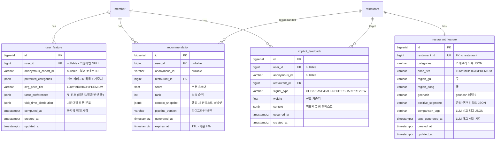

<br>

## **[3-2] 데이터베이스 스키마 (ERD)**

- ERD Cloud: [https://www.erdcloud.com/d/TXZ3CApePpKwEyacT](https://www.erdcloud.com/d/TXZ3CApePpKwEyacT)
- ERD 테이블 정의서: [ERD 테이블 정의서](https://github.com/100-hours-a-week/3-team-tasteam-wiki/wiki/%5BERD%5D-%ED%85%8C%EC%9D%B4%EB%B8%94-%EC%A0%95%EC%9D%98%EC%84%9C)

**주요 테이블 요약**

- `user_feature`: 사용자별 집계된 선호 피처 (배치 갱신)
- `restaurant_feature`: 음식점별 정적·동적 피처 (LLM 태그 포함)
- `recommendation`: 사전 계산된 사용자별 추천 결과 (TTL 기반 만료)
- `implicit_feedback`: 추천 노출 후 수집된 암묵적 피드백 이벤트

**관계 요약**

- `user_feature.user_id` → `member.id` (N:1, RESTRICT, nullable — 익명 사용자는 `anonymous_cohort_id` 사용)
- `restaurant_feature.restaurant_id` → `restaurant.id` (1:1, CASCADE)
- `recommendation.user_id` → `member.id` (N:1, nullable)
- `recommendation.restaurant_id` → `restaurant.id` (N:1, RESTRICT)
- `implicit_feedback.restaurant_id` → `restaurant.id` (N:1, RESTRICT)

**ERD (Mermaid)**



**테이블 정의서**

#### `user_feature`

| 컬럼 | 타입 | Nullable | 기본값 | 설명 | 제약/고려사항 |
|---|---|---|---|---|---|
| `id` | `BIGSERIAL` | N | auto | PK | |
| `user_id` | `BIGINT` | Y | NULL | 로그인 사용자 ID | FK → member(id), nullable |
| `anonymous_cohort_id` | `VARCHAR(100)` | Y | NULL | 익명 사용자 코호트 ID | nullable, UNIQUE 별도 |
| `preferred_categories` | `JSONB` | N | `'[]'` | 선호 카테고리 + 가중치 `[{"category":"한식","weight":0.8}]` | NOT NULL |
| `avg_price_tier` | `VARCHAR(20)` | Y | NULL | `LOW` / `MID` / `HIGH` / `PREMIUM` | enum |
| `taste_preferences` | `JSONB` | N | `'{}'` | 맛 선호도 `{"spicy":0.7,"sweet":0.3}` | NOT NULL |
| `visit_time_distribution` | `JSONB` | N | `'{}'` | 시간대별 방문 비율 `{"lunch":0.6,"dinner":0.4}` | NOT NULL |
| `computed_at` | `TIMESTAMPTZ` | N | `NOW()` | 마지막 배치 집계 시각 | NOT NULL |
| `created_at` | `TIMESTAMPTZ` | N | `NOW()` | | |
| `updated_at` | `TIMESTAMPTZ` | N | `NOW()` | | |

**주요 인덱스**

| 테이블 | 인덱스 명 | 컬럼 | 목적 |
|---|---|---|---|
| `user_feature` | `uq_user_feature_user_id` | `user_id` | 사용자별 단일 피처 보장 |
| `user_feature` | `uq_user_feature_anonymous_cohort_id` | `anonymous_cohort_id` | 익명 코호트별 단일 피처 보장 |

#### `restaurant_feature`

| 컬럼 | 타입 | Nullable | 기본값 | 설명 | 제약/고려사항 |
|---|---|---|---|---|---|
| `id` | `BIGSERIAL` | N | auto | PK | |
| `restaurant_id` | `BIGINT` | N | - | 음식점 ID | FK → restaurant(id), UNIQUE |
| `categories` | `JSONB` | N | `'[]'` | 카테고리 목록 `["한식","분식"]` | NOT NULL |
| `price_tier` | `VARCHAR(20)` | Y | NULL | `LOW` / `MID` / `HIGH` / `PREMIUM` | enum |
| `region_gu` | `VARCHAR(50)` | Y | NULL | 구 (e.g. `강남구`) | nullable |
| `region_dong` | `VARCHAR(50)` | Y | NULL | 동 (e.g. `역삼동`) | nullable |
| `geohash` | `VARCHAR(20)` | Y | NULL | geohash 레벨 6 (약 1.2km 정밀도) | nullable |
| `positive_segments` | `JSONB` | N | `'[]'` | 긍정 구간 키워드 `["혼밥 가능","주차 편리"]` | NOT NULL |
| `comparison_tags` | `JSONB` | N | `'[]'` | LLM 추출 비교 태그 `[{"tag":"웨이팅 없음","confidence":0.9}]` | NOT NULL |
| `tags_generated_at` | `TIMESTAMPTZ` | Y | NULL | LLM 태그 마지막 생성 시각 | nullable — NULL이면 미생성 |
| `created_at` | `TIMESTAMPTZ` | N | `NOW()` | | |
| `updated_at` | `TIMESTAMPTZ` | N | `NOW()` | | |

**주요 인덱스**

| 테이블 | 인덱스 명 | 컬럼 | 목적 |
|---|---|---|---|
| `restaurant_feature` | `uq_restaurant_feature_restaurant_id` | `restaurant_id` | 음식점별 단일 피처 보장 |
| `restaurant_feature` | `idx_restaurant_feature_geohash` | `geohash` | 위치 기반 피처 조회 |

#### `recommendation`

| 컬럼 | 타입 | Nullable | 기본값 | 설명 | 제약/고려사항 |
|---|---|---|---|---|---|
| `id` | `BIGSERIAL` | N | auto | PK | |
| `user_id` | `BIGINT` | Y | NULL | 로그인 사용자 ID | FK → member(id), nullable |
| `anonymous_id` | `VARCHAR(100)` | Y | NULL | 익명 사용자 ID | nullable |
| `restaurant_id` | `BIGINT` | N | - | 추천 음식점 ID | FK → restaurant(id) |
| `score` | `FLOAT` | N | - | 추천 스코어 (0.0 ~ 1.0) | NOT NULL |
| `rank` | `INTEGER` | N | - | 사용자 내 노출 순위 (1-indexed) | NOT NULL |
| `context_snapshot` | `JSONB` | N | `'{}'` | 생성 시 컨텍스트 (요일/시간대/날씨/거리 bucket 등) | NOT NULL |
| `pipeline_version` | `VARCHAR(30)` | N | - | 추천 파이프라인 버전 (e.g. `v1.0`) | NOT NULL |
| `generated_at` | `TIMESTAMPTZ` | N | `NOW()` | 생성 시각 | NOT NULL |
| `expires_at` | `TIMESTAMPTZ` | N | - | 만료 시각 (기본 24h) | NOT NULL, TTL 기반 무효화 |

**주요 인덱스**

| 테이블 | 인덱스 명 | 컬럼 | 목적 |
|---|---|---|---|
| `recommendation` | `idx_recommendation_user_expires_rank` | `(user_id, expires_at, rank)` | 사용자별 유효 추천 조회 |
| `recommendation` | `idx_recommendation_anonymous_expires_rank` | `(anonymous_id, expires_at, rank)` | 익명 사용자 추천 조회 |

#### `implicit_feedback`

| 컬럼 | 타입 | Nullable | 기본값 | 설명 | 제약/고려사항 |
|---|---|---|---|---|---|
| `id` | `BIGSERIAL` | N | auto | PK | |
| `user_id` | `BIGINT` | Y | NULL | 로그인 사용자 ID | FK → member(id), nullable |
| `anonymous_id` | `VARCHAR(100)` | Y | NULL | 익명 사용자 ID | nullable |
| `restaurant_id` | `BIGINT` | N | - | 대상 음식점 ID | FK → restaurant(id) |
| `signal_type` | `VARCHAR(20)` | N | - | `CLICK` / `SAVE` / `CALL` / `ROUTE` / `SHARE` / `REVIEW` | NOT NULL |
| `weight` | `FLOAT` | N | - | 신호 가중치 (아래 피드백 가중치 표 참고) | NOT NULL |
| `context` | `JSONB` | N | `'{}'` | 발생 컨텍스트 (fromPageKey, sessionId 등) | NOT NULL |
| `occurred_at` | `TIMESTAMPTZ` | N | - | 피드백 발생 시각 | NOT NULL |
| `created_at` | `TIMESTAMPTZ` | N | `NOW()` | 저장 시각 | |

**주요 인덱스**

| 테이블 | 인덱스 명 | 컬럼 | 목적 |
|---|---|---|---|
| `implicit_feedback` | `idx_implicit_feedback_user_occurred` | `(user_id, occurred_at DESC)` | 사용자별 피드백 이력 집계 |
| `implicit_feedback` | `idx_implicit_feedback_restaurant_signal` | `(restaurant_id, signal_type)` | 음식점별 신호 집계 |

<br>

## **[3-3] 피처 정의 (Feature Catalog)**

### User Feature (사용자 피처)

| 피처명 | 타입 | 도출 방법 | 갱신 주기 |
|---|---|---|---|
| `preferred_categories` | `JSONB` | `ui.restaurant.clicked` + `ui.favorite.updated` 기반 카테고리 빈도 집계 | 매일 새벽 배치 |
| `avg_price_tier` | `enum` | 방문·찜 음식점의 가격대 중앙값 | 매일 새벽 배치 |
| `taste_preferences` | `JSONB` | 리뷰 키워드 + 찜 음식점 태그 집계 | 매일 새벽 배치 |
| `visit_time_distribution` | `JSONB` | `ui.restaurant.clicked` 의 `occurredAt` 시간대 분포 | 매일 새벽 배치 |

**`preferred_categories` 예시:**
```json
[
  { "category": "한식", "weight": 0.65 },
  { "category": "분식", "weight": 0.20 },
  { "category": "카페", "weight": 0.15 }
]
```

**`visit_time_distribution` 예시:**
```json
{
  "breakfast": 0.05,
  "lunch": 0.60,
  "afternoon": 0.10,
  "dinner": 0.25
}
```

**`taste_preferences` 예시:**
```json
{
  "spicy": 0.7,
  "sweet": 0.3,
  "savory": 0.8,
  "light": 0.4
}
```

---

### Item Feature (음식점 피처)

| 피처명 | 타입 | 도출 방법 | 갱신 주기 |
|---|---|---|---|
| `categories` | `JSONB` | 음식점 메타 데이터 | 음식점 등록/수정 시 |
| `price_tier` | `enum` | 음식점 메타 데이터 | 음식점 등록/수정 시 |
| `region_gu` / `region_dong` | `VARCHAR` | 주소 파싱 | 음식점 등록/수정 시 |
| `geohash` | `VARCHAR` | 좌표 → geohash 변환 (레벨 6) | 음식점 등록/수정 시 |
| `positive_segments` | `JSONB` | 리뷰 키워드 집계 (긍정 감성 분류) | 주 1회 배치 |
| `comparison_tags` | `JSONB` | LLM 호출 — 리뷰 요약 기반 비교 태그 추출 | 주 1회 배치 또는 리뷰 N건 누적 시 |

**`positive_segments` 예시:**
```json
["혼밥 가능", "주차 편리", "조용한 분위기", "웨이팅 짧음"]
```

**`comparison_tags` 예시 (LLM 추출):**
```json
[
  { "tag": "가성비 최고", "confidence": 0.92 },
  { "tag": "웨이팅 없음", "confidence": 0.85 },
  { "tag": "직장인 점심 추천", "confidence": 0.78 }
]
```

---

### Context Feature (컨텍스트 피처)

컨텍스트 피처는 DB에 별도 저장하지 않고, 추천 생성·서빙 시 요청 컨텍스트로 실시간 주입된다.
생성된 `recommendation.context_snapshot`에 스냅샷으로 보존한다.

| 피처명 | 타입 | 도출 방법 | 비고 |
|---|---|---|---|
| `day_of_week` | `string` | 요청 시각 → 요일 변환 | `MON`~`SUN` |
| `time_slot` | `string` | 요청 시각 → 시간대 버킷 | `breakfast` / `lunch` / `afternoon` / `dinner` / `late_night` |
| `admin_dong` | `string` | 클라이언트 전송 위치 → 행정동 역지오코딩 | 없으면 NULL |
| `geohash` | `string` | 클라이언트 좌표 → geohash 레벨 6 변환 | 없으면 NULL |
| `distance_bucket` | `string` | 사용자-음식점 거리 버킷팅 | `NEAR(<500m)` / `CLOSE(<2km)` / `MID(<5km)` / `FAR(5km+)` |
| `weather_bucket` | `string` | 날씨 API 기반 버킷팅 | `CLEAR` / `CLOUDY` / `RAIN` / `SNOW` |
| `dining_type` | `string` | 사용자 직접 선택 또는 추론 | `SOLO` / `GROUP` |

**`context_snapshot` 저장 예시:**
```json
{
  "day_of_week": "WED",
  "time_slot": "lunch",
  "admin_dong": "역삼동",
  "geohash": "wydm6v",
  "distance_bucket": "NEAR",
  "weather_bucket": "CLEAR",
  "dining_type": "SOLO"
}
```

<br>

## **[3-4] 암묵적 피드백 신호 정의**

추천 음식점에 대한 사용자 반응을 암묵적 피드백으로 수집하여 다음 파이프라인 입력에 활용한다.

### 피드백 가중치

| 신호(signal_type) | 가중치(weight) | 근거 | 대응 Analytics 이벤트 |
|---|---|---|---|
| `REVIEW` | 1.0 | 가장 강한 의향 표현 | `ui.review.submitted` |
| `CALL` | 0.8 | 방문 의향 높음 | `ui.restaurant.called` (신규) |
| `ROUTE` | 0.7 | 실제 이동 의향 | `ui.restaurant.routed` (신규) |
| `SAVE` | 0.6 | 관심 저장 | `ui.favorite.updated` |
| `SHARE` | 0.4 | 공유 = 관심 | `ui.restaurant.shared` (신규) |
| `CLICK` | 0.2 | 탐색 의향 (약한 신호) | `ui.restaurant.clicked` |

> **신규 Analytics 이벤트 추가 필요:**
> `ui.restaurant.called`, `ui.restaurant.routed`, `ui.restaurant.shared` 3개를 Analytics 화이트리스트에 추가해야 한다. 각 이벤트의 properties는 `{ restaurantId, fromPageKey }` 로 통일한다.

### 피드백 수집 방법

- `CLICK`, `SAVE`, `REVIEW` → 기존 `user_activity_event` 이벤트를 배치로 읽어 `implicit_feedback`에 변환 저장
- `CALL`, `ROUTE`, `SHARE` → 신규 Analytics 이벤트 등록 후 동일하게 변환 저장

<br>

## **[3-5] API 명세 (API Specifications)**

- **목차:**
    - [AI 추천 음식점 조회 (GET /api/v1/recommendations/restaurants)](#ai-추천-음식점-조회-api)
    - [피드백 이벤트 수집 (POST /api/v1/recommendations/feedback)](#피드백-이벤트-수집-api)

<br>